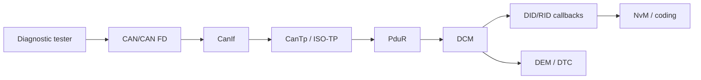

# AUTOSAR Diagnostic Stack — Theory, Configuration and Practice

[](https://github.com/GiaBao1802/autosar-diagnostic-stack-course/actions/workflows/build.yml)

Khóa học từ CAN frame tới UDS service và application callback, kèm lab DCM/ISO-TP độc lập. Case study dựa trên **workflow** quan sát trong workspace Toshiba MICROSAR, nhưng không sao chép requirement, identifier, generated code hay source thương mại.



## Nội dung

### Phần I — Protocol và AUTOSAR stack

1. [UDS protocol và diagnostic services](docs/01_uds_protocol.md)
2. [DCM: architecture, ECUC parameters và Toshiba snapshot](docs/02_dcm_configuration.md)
3. [Transport stack: CanIf, CanTp, PduR và RX/TX flow](docs/03_transport_stack.md)
4. [DEM: event, DTC, debounce, memory và NvM](docs/04_dem_configuration.md)
5. [AUTOSAR diagnostic API reference](docs/05_autosar_api_reference.md)

### Phần II — Thực hành và verification

6. [UDS use cases: VIN, variant, reset, DTC và routine](docs/06_real_uds_use_cases.md)
7. [Requirement → configuration → generated artifacts và lab](docs/07_requirement_to_config_lab.md)
8. [Testing, CANoe/ODX, SIL/HIL và debugging](docs/08_testing_tools_debugging.md)

### Phần III — Protocol mở rộng

9. [OBD fundamentals](docs/09_obd_fundamentals.md)
10. [Automotive Ethernet và DoIP](docs/10_doip_ethernet.md)

## Nguồn tham khảo

Curriculum được rà gap bằng [Udemy AUTOSAR Diagnostics course](https://www.udemy.com/course/autosar-diagnostics-dem-dcm-obd-uds/) từ phần mô tả công khai. Nội dung kỹ thuật trong repo được viết độc lập và đối chiếu AUTOSAR DCM/DEM/DoIP specifications; không sao chép bài giảng trả phí.

## Lab services

- `0x10` DiagnosticSessionControl
- `0x11` ECUReset (Hard Reset)
- `0x22` ReadDataByIdentifier
- `0x2E` WriteDataByIdentifier
- `0x27` SecurityAccess với seed/key học tập
- `0x31` RoutineControl
- `0x3E` TesterPresent
- ISO-TP SF/FF/CF/FC segmentation/reassembly model
- DID `0xF190` VIN response 17 ASCII bytes, tự động thành multi-frame trên Classic CAN

Toy security algorithm không được dùng trong sản phẩm thật.

## Build và chạy lab

```bash
cmake -S . -B build
cmake --build build
ctest --test-dir build --output-on-failure
./build/diag_demo
```
