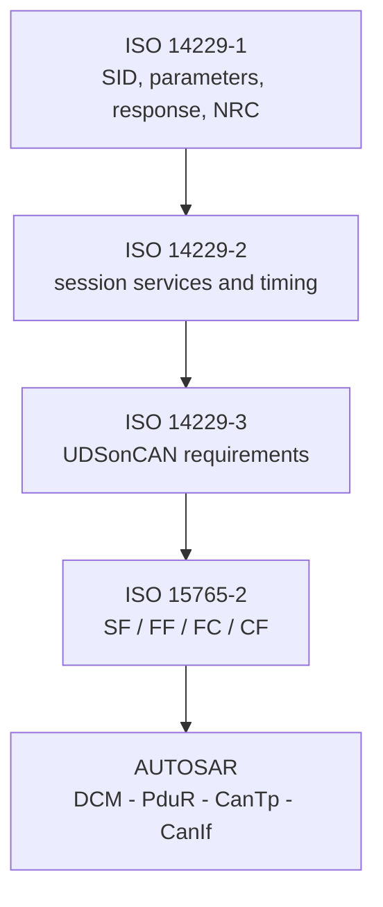
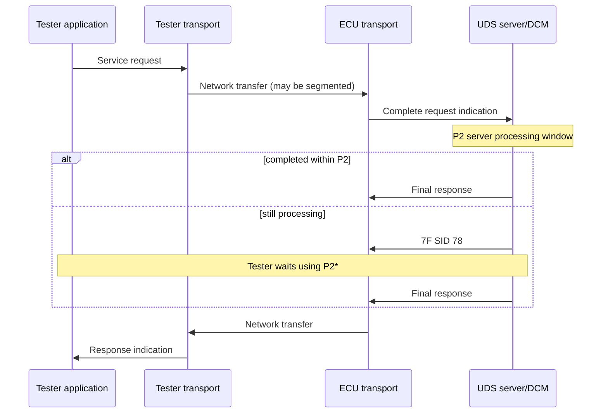

# UDS protocol và diagnostic services

UDS — Unified Diagnostic Services — là giao thức chẩn đoán ở application layer, được chuẩn hóa trong ISO 14229-1. UDS định nghĩa tester và ECU trao đổi **dịch vụ gì**, request/response có ý nghĩa gì và ECU phải xử lý lỗi như thế nào. UDS không quy định trực tiếp cách chia dữ liệu thành CAN frame; khi chạy trên CAN, phần transport/network thường do ISO-TP đảm nhiệm.

> Tài liệu này diễn giải để học tập, không thay thế bản ISO chính thức. Tên service, tham số và hành vi cuối cùng phải được kiểm tra với phiên bản ISO/OEM specification áp dụng cho dự án.

## 1. UDS nằm ở đâu trong communication stack?

```text
Diagnostic tester
      │
      │ UDS request: 22 F1 88
      ▼
┌──────────────────────────────┐
│ UDS application layer        │  ISO 14229-1
│ SID, DID, RID, NRC, session  │
└──────────────────────────────┘
      │ diagnostic message
      ▼
┌──────────────────────────────┐
│ Session layer                │  ISO 14229-2
│ timing, request/response     │
└──────────────────────────────┘
      │ N-SDU
      ▼
┌──────────────────────────────┐
│ ISO-TP / network transport   │  ISO 15765-2 for CAN
│ SF, FF, CF, FC               │
└──────────────────────────────┘
      │ CAN frame(s)
      ▼
CAN interface → CAN driver → CAN bus
```

Cùng một UDS payload có thể được vận chuyển qua CAN, CAN FD, DoIP/Ethernet, FlexRay hoặc LIN bằng profile tương ứng. Vì vậy:

- `22 F1 88` là UDS request, không phải một CAN frame hoàn chỉnh.
- CAN ID, DLC, SF/FF/CF/FC không thuộc phần service definition của UDS.
- UDS message dài có thể tạo thành nhiều CAN frame nhưng vẫn chỉ là **một request** đối với DCM.

## 2. Client–server model

- **Client/tester** gửi request: diagnostic tool, production tool hoặc test automation.
- **Server/ECU** kiểm tra request, thực hiện service và trả response.
- Thông thường một ECU chỉ xử lý một request trên một diagnostic connection tại một thời điểm.
- Một service được “support” chưa có nghĩa luôn được phép chạy; nó còn phụ thuộc session, security level, addressing type và điều kiện hệ thống.

```text
Tester                                      ECU
  │                                          │
  │ Request: 22 F1 88                        │
  ├─────────────────────────────────────────►│
  │                         validate/process │
  │ Positive: 62 F1 88 <data>                │
  │◄─────────────────────────────────────────┤
```

## 3. Cấu trúc UDS request

Không phải service nào cũng có cùng layout. Dạng tổng quát là:

```text
Request = SID + service-specific parameters + optional data
```

| Thành phần | Kích thước thường gặp | Ý nghĩa |
|---|---:|---|
| SID | 1 byte | Service identifier, ví dụ `0x22` ReadDataByIdentifier. |
| Subfunction | 1 byte | Chọn operation con, ví dụ `0x10 03` vào extended session. |
| Identifier | thường 2–3 byte | DID, RID, DTC group hoặc memory identifier tùy service. |
| Data parameter | thay đổi | Giá trị ghi, key, option record hoặc control data. |

Ba ví dụ khác nhau:

```text
10 03
│  └─ diagnosticSessionType = extendedSession
└──── SID = DiagnosticSessionControl

22 F1 88
│  └──── DID = 0xF188
└─────── SID = ReadDataByIdentifier

31 01 D1 00 12 34
│  │  │     └──── routineControlOptionRecord
│  │  └────────── RID = 0xD100
│  └───────────── subfunction = startRoutine
└──────────────── SID = RoutineControl
```

Không nên học công thức cứng “SID + subfunction + data”, vì `0x22` không có subfunction còn `0x14` dùng groupOfDTC. Phải đọc layout riêng của từng service.

## 4. Positive response

Đối với phần lớn service:

```text
Positive response SID = Request SID + 0x40
```

Ví dụ:

```text
Request : 22 F1 88
Response: 62 F1 88 12 34 56 ...
          │  │     └──────── DID data
          │  └────────────── echoed DID
          └───────────────── 0x22 + 0x40
```

ECU thường echo identifier/subfunction để tester ghép response với request. Dữ liệu cụ thể sau positive SID phụ thuộc service.

Một số operation như reset có thể cần gửi positive response trước rồi ECU mới thực hiện hành động làm mất communication. Tester phải chấp nhận khoảng mất kết nối và reconnect sau boot time.

## 5. Negative response và NRC

Negative response có layout cố định:

```text
7F <request SID> <NRC>
```

Ví dụ:

```text
Request : 2E F1 90 <data>
Response: 7F 2E 33
          │  │  └─ securityAccessDenied
          │  └──── original request SID
          └─────── negativeResponse SID
```

| NRC | Tên thường dùng | Khi nào gặp |
|---:|---|---|
| `0x10` | generalReject | Không thể dùng NRC cụ thể hơn; không nên lạm dụng. |
| `0x11` | serviceNotSupported | ECU không implement SID. |
| `0x12` | subFunctionNotSupported | SID có nhưng subfunction không có. |
| `0x13` | incorrectMessageLengthOrInvalidFormat | Sai chiều dài hoặc format request. |
| `0x14` | responseTooLong | Response vượt giới hạn server/transport. |
| `0x21` | busyRepeatRequest | Server đang bận; tester chờ rồi gửi lại request. |
| `0x22` | conditionsNotCorrect | Vehicle/ECU state không cho phép operation. |
| `0x24` | requestSequenceError | Sai thứ tự, ví dụ TransferData khi chưa RequestDownload. |
| `0x31` | requestOutOfRange | DID/RID/range/value không được support hoặc ngoài phạm vi. |
| `0x33` | securityAccessDenied | Chưa đạt security level cần thiết. |
| `0x35` | invalidKey | Key không khớp seed/challenge. |
| `0x36` | exceedNumberOfAttempts | Vượt số lần thử security. |
| `0x37` | requiredTimeDelayNotExpired | Chưa hết delay sau các lần key sai. |
| `0x70` | uploadDownloadNotAccepted | ECU không chấp nhận download/upload setup. |
| `0x71` | transferDataSuspended | Transfer bị tạm dừng/lỗi state. |
| `0x72` | generalProgrammingFailure | Lỗi erase/program/verify memory. |
| `0x73` | wrongBlockSequenceCounter | Sai blockSequenceCounter của `0x36`. |
| `0x78` | requestCorrectlyReceivedResponsePending | Request hợp lệ nhưng chưa xử lý xong. |
| `0x7E` | subFunctionNotSupportedInActiveSession | Subfunction có nhưng không ở session hiện tại. |
| `0x7F` | serviceNotSupportedInActiveSession | Service có nhưng không ở session hiện tại. |

Phân biệt ba lỗi dễ nhầm:

```text
0x11: ECU không support service
0x7F: ECU support service, nhưng không trong session hiện tại
0x33: Session có thể đúng, nhưng security level chưa đủ
```

## 6. Subfunction byte và suppressPosRspMsgIndicationBit

Với service có subfunction, bit 7 của byte subfunction thường được dùng làm `suppressPosRspMsgIndicationBit`:

```text
bit 7 = 0: ECU trả positive response bình thường
bit 7 = 1: nếu xử lý thành công, ECU không gửi positive response
bits 6..0: giá trị subfunction thực
```

Ví dụ TesterPresent:

```text
3E 00 → positive response 7E 00
3E 80 → xử lý TesterPresent nhưng suppress positive response
```

Suppress positive response **không có nghĩa suppress mọi negative response**. ECU vẫn có thể trả NRC nếu request lỗi, tùy addressing và rule của service. DCM phải mask bit 7 trước khi tìm subfunction `0x00`.

## 7. Physical và functional addressing

### Physical request

Request nhắm đến một ECU cụ thể. ECU có thể trả positive hoặc negative response theo service rules. Các operation thay đổi state như write DID, routine hoặc download thường dùng physical addressing.

### Functional request

Request broadcast đến một nhóm ECU, ví dụ tester hỏi toàn mạng. Mỗi ECU tự quyết định xử lý. Để tránh response storm, một số negative response có thể bị suppress đối với functional request theo rule của ISO/OEM.

```text
Physical:   Tester ──request──► ECU A ──response──► Tester

Functional: Tester ──request──► ECU A
                         ├─────► ECU B
                         └─────► ECU C
```

Addressing type không nằm trong UDS payload. Nó đến từ transport/network configuration như CAN ID, target address hoặc DoIP logical address, rồi được DCM dùng trong authorization.

## 8. Session, security và conditions là các gate độc lập

```text
Request received
      │
      ├─ SID/subfunction supported? ── no → NRC 11/12
      │
      ├─ allowed in active session? ── no → NRC 7E/7F
      │
      ├─ required security unlocked? ─ no → NRC 33
      │
      ├─ length/range valid? ───────── no → NRC 13/31
      │
      ├─ vehicle conditions valid? ─── no → NRC 22
      │
      └─ execute → positive response hoặc NRC 78 khi còn xử lý
```

- **Session** chọn diagnostic operating mode: default, programming, extended hoặc OEM session.
- **Security level** cấp quyền cho operation nhạy cảm sau challenge–response.
- **Conditions** là trạng thái runtime: vehicle speed, ignition, voltage, gear, NvM busy, programming precondition…

Ví dụ `2E F1 90` có thể được cấu hình chỉ cho extended session, yêu cầu security level 1 và chỉ chạy khi vehicle đứng yên. Đạt một gate không bỏ qua các gate còn lại.

## 9. Diagnostic timing: P2, P2* và S3

### P2ServerMax

Thời gian tối đa từ khi server nhận request hoàn chỉnh đến khi bắt đầu gửi response. Tester dùng P2Client lớn hơn một margin để chờ.

### P2StarServerMax

Nếu operation chưa hoàn thành trong P2, ECU có thể trả:

```text
7F <SID> 78
```

Sau NRC `0x78`, tester chuyển sang timeout P2* dài hơn. ECU có thể gửi thêm `0x78` nếu vẫn đang xử lý, nhưng phải tuân thủ giới hạn và policy của implementation/OEM.

```text
Tester                         ECU
  │ 31 01 D1 00                 │
  ├────────────────────────────►│
  │       before P2 expires     │ erase/calculation still running
  │ 7F 31 78                    │
  │◄────────────────────────────┤
  │          wait P2*           │
  │ 71 01 D1 00 <result>        │
  │◄────────────────────────────┤
```

### S3Server

S3 là inactivity timer của non-default session. Request hợp lệ, thường gồm `3E 00` hoặc `3E 80`, giữ session sống. Hết S3, ECU trở về default session; security state thường cũng bị reset theo implementation/policy.

P2/P2*/S3 là UDS/session timing. `N_As`, `N_Bs`, `N_Cr`… là ISO-TP timing và xử lý ở CanTp — không được trộn hai nhóm timer.

## 10. Các service quan trọng và byte layout

### 10.1 DiagnosticSessionControl — `0x10`

```text
Request : 10 <diagnosticSessionType>
Positive: 50 <diagnosticSessionType> <P2ServerMax> <P2StarServerMax>
```

Subfunction phổ biến: `01` default, `02` programming, `03` extended. ECU kiểm tra session transition/preconditions. Không có quy tắc chung bắt buộc phải gửi `10 01` trước `10 03`; transition hợp lệ do ECU/OEM configuration quyết định.

### 10.2 ECUReset — `0x11`

```text
Request : 11 <resetType>
Positive: 51 <resetType> [powerDownTime]
```

`01` thường là hard reset. ECU có thể gửi response trước reset, lưu state cần thiết, yêu cầu BswM/EcuM reset và mất communication trong boot time.

### 10.3 ReadDataByIdentifier — `0x22`

```text
Request : 22 <DID_H> <DID_L> [additional DID...]
Positive: 62 <DID_H> <DID_L> <data> [...]
```

DID là định danh data object, không phải địa chỉ RAM. Ví dụ đọc VIN thường dùng DID do OEM/standard quy định; độ dài và quyền truy cập nằm trong data definition/configuration.

### 10.4 WriteDataByIdentifier — `0x2E`

```text
Request : 2E <DID_H> <DID_L> <dataRecord>
Positive: 6E <DID_H> <DID_L>
```

Flow variant coding điển hình:

```text
enter required session
 → unlock security nếu cấu hình yêu cầu
 → 2E <variant DID> <coding bytes>
 → validate length/range/vehicle condition
 → write NvM/application data
 → positive response
 → optional apply-coding routine/reset
 → read back with 0x22 and verify behavior
```

Việc có security, reset hoặc apply routine hay không là requirement/configuration của ECU, không phải mọi `0x2E` đều bắt buộc giống nhau.

### 10.5 SecurityAccess — `0x27`

```text
27 <odd level>            → request seed
67 <odd level> <seed>     ← positive response
27 <even level> <key>     → send key
67 <even level>           ← unlocked
```

Odd/even thường tạo thành một cặp level như `01/02`. Tester không “gửi `27 01 27 02` cùng lúc”; phải nhận seed, tính key bằng thuật toán được cấp rồi mới gửi key. NRC quan trọng: `0x35`, `0x36`, `0x37`.

### 10.6 ReadDTCInformation — `0x19`

Layout thay đổi theo subfunction. Ví dụ report DTC by status mask:

```text
Request : 19 02 <DTCStatusMask>
Positive: 59 02 <DTCStatusAvailabilityMask>
          [DTC_H DTC_M DTC_L DTCStatus]...
```

DCM xử lý request protocol; DEM cung cấp DTC filter, status, snapshot và extended data. Status mask yêu cầu chọn DTC có ít nhất một bit giao với mask.

### 10.7 ClearDiagnosticInformation — `0x14`

```text
Request : 14 <groupOfDTC: 3 bytes>
Positive: 54
```

Clear không chỉ xóa một biến RAM. DEM có thể cập nhật event memory/status, freeze frame, extended data và NvM; response timing phụ thuộc configured clear behavior.

### 10.8 RoutineControl — `0x31`

```text
Request : 31 <routineControlType> <RID_H> <RID_L> [optionRecord]
Positive: 71 <routineControlType> <RID_H> <RID_L> [statusRecord]
```

Subfunction phổ biến: `01` start, `02` stop, `03` request results. `03` không chạy routine lần nữa; nó hỏi kết quả/state của routine đã được start trước đó. ECU có thể trả `0x24` nếu sequence không hợp lệ.

### 10.9 TesterPresent — `0x3E`

```text
Request : 3E 00
Positive: 7E 00

Request : 3E 80
Positive: suppressed when successful
```

TesterPresent restart S3 nhưng không tự unlock security và không đảm bảo seed/key state được giữ vô hạn.

### 10.10 Download sequence — `0x34`, `0x36`, `0x37`

```text
10 02                         enter programming session
27 xx                         unlock required security level
31 01 <erase/check RID> ...   programming preparation
34 ...                        RequestDownload
36 01 <block data>            TransferData block 1
36 02 <block data>            TransferData block 2
...
37 ...                        RequestTransferExit
31 01 <verify RID> ...        optional integrity verification
11 01                         reset
```

`blockSequenceCounter` giúp phát hiện block thiếu/lặp/sai thứ tự; đây không phải ISO-TP consecutive-frame sequence number. Một TransferData request bản thân nó vẫn có thể được ISO-TP chia thành nhiều CAN CF.

## 11. Request processing example trong AUTOSAR DCM

Ví dụ tester gửi `22 F1 88`:

```text
1. CanTp reassemble đủ request và báo PduR.
2. PduR giao N-SDU cho DCM DSL.
3. DSL xác định connection/protocol/addressing và quản lý buffer/timing.
4. DSD tìm service 0x22 trong active service table.
5. DSD/DSP kiểm tra session, security và request length.
6. DSP tìm DID 0xF188 và DidAccess configuration.
7. DSP gọi condition-check/read callback hoặc RTE port.
8. DSP tạo 62 F1 88 <data>, hoặc NRC phù hợp.
9. DCM giao response qua PduR; CanTp segment và gửi xuống CanIf.
```

Nếu data callback trả pending, DCM có thể quản lý asynchronous operation và gửi NRC `0x78` trước P2 deadline. Nếu CanTp đang reassemble dở request thì P2 của DCM chưa được hiểu giống N_Cr của CanTp.

## 12. Checklist phân tích một UDS requirement

Khi nhận requirement như “ECU shall support writing variant DID”, cần break down:

1. SID, DID/RID/subfunction và exact request/response layout.
2. Physical hay functional addressing.
3. Allowed session và session transition.
4. Security level và lockout/delay policy.
5. Data length, endian, range và invalid-value behavior.
6. Runtime preconditions: ignition, speed, voltage, gear, NvM state.
7. Synchronous, asynchronous hay pending response; P2/P2*.
8. Data owner/callback và NvM persistence.
9. NRC cho từng failure path, không dùng một NRC cho mọi lỗi.
10. Reset/apply/rollback/read-back behavior.
11. Positive, negative, boundary, sequence và power-cycle tests.

## 13. Đọc UDS theo đúng ba phần ISO 14229

Ba phần này không phải ba protocol độc lập. Chúng mô tả ba góc nhìn của cùng một cuộc hội thoại chẩn đoán:

| Phần | Câu hỏi nó trả lời | Không nên nhầm với |
|---|---|---|
| ISO 14229-1 | Request/response có ý nghĩa gì, service có parameter nào, positive/NRC nào? | CAN ID, SF/FF/CF và AUTOSAR API. |
| ISO 14229-2 | Client/server trao đổi theo session như thế nào, timing có ý nghĩa ở service boundary ra sao? | Task period của DCM hoặc timer N_xx của ISO-TP. |
| ISO 14229-3 | Các yêu cầu chung được áp dụng cho UDS chạy trên CAN như thế nào? | Thuật toán segment chi tiết của ISO 15765-2. |



### 13.1 ISO 14229-1 — application layer

Application layer làm việc với **diagnostic message hoàn chỉnh**. Ví dụ `22 F1 88` là một request dù ở dưới nó đi bằng một CAN frame hay nhiều frame. Với mỗi service phải tra đủ:

1. request parameter record và chiều dài;
2. positive response parameter record;
3. supported addressing type;
4. session/security/precondition;
5. NRC áp dụng và điều kiện tạo NRC;
6. effect của suppress-positive-response bit nếu service có subfunction;
7. behavior khi operation chạy bất đồng bộ.

Các service được gom theo mục đích:

| Nhóm | SID tiêu biểu | Trách nhiệm |
|---|---|---|
| Diagnostic/communication management | `10`, `11`, `27`, `28`, `3E`, `83`, `84`, `85`, `86`, `87` | Session, reset, quyền truy cập, communication và diagnostic state. |
| Data transmission | `22`, `23`, `24`, `2A`, `2C`, `2E`, `3D` | Đọc/ghi data theo DID hoặc memory. |
| Stored data | `14`, `19` | Clear và đọc DTC/snapshot/extended data. |
| Input/output control | `2F` | Tạm thời điều khiển một data object/I/O theo policy ECU. |
| Routine | `31` | Start, stop hoặc lấy kết quả routine. |
| Upload/download | `34`–`38` | Thiết lập, truyền và kết thúc data transfer. |

Thứ tự validation không nên hard-code từ sơ đồ học tập. Một DCM thực tế dùng service processor và configuration để chọn NRC phù hợp. Hai lỗi cùng tồn tại không có nghĩa tester được quyền đoán NRC nào sẽ thắng; phải đối chiếu ISO edition, AUTOSAR/OEM rule và implementation.

### 13.2 ISO 14229-2 — session layer và timing independence

Ý chính của “timing independence” là semantics của service không phụ thuộc CAN, Ethernet hay transport cụ thể. Session layer nhìn thấy request/response data unit hoàn chỉnh và dùng service primitives mang ý nghĩa request, indication, response và confirmation; tên primitive cụ thể trong tài liệu chuẩn không đồng nghĩa trực tiếp với một hàm C duy nhất.



Điểm cần nhớ:

- P2/P2* đo behavior của diagnostic server sau khi nhận **đủ request**, không thay thế `N_Bs`, `N_Cr` của CanTp.
- DCM main function 2 ms không có nghĩa P2 = 2 ms; task period chỉ là độ phân giải/lịch chạy của implementation.
- S3 quản lý inactivity của non-default session. `3E` thường refresh S3 nhưng không mặc nhiên giữ security state qua mọi transition/reset.
- `0x78` là response hợp lệ cho operation đang xử lý, không phải lời giải cho task bị treo. Server vẫn cần giới hạn số lần/khoảng cách response-pending theo cấu hình và OEM rule.

Ví dụ cấu hình Toshiba đang học có DCM task `2 ms`, P2 server `50 ms` và P2* server `5 s`. Đây là ba đại lượng khác nhau: lịch polling, deadline response ban đầu và deadline sau response pending.

### 13.3 ISO 14229-3 — UDS on CAN

ISO 14229-3 áp dụng service/session UDS lên CAN và dựa vào network/transport profile của ISO 15765. Chuỗi AUTOSAR RX thực tế là:

```text
CAN frame
  -> Can Driver / CanIf: nhận CAN ID, DLC, payload
  -> CanTp: nhận SF hoặc ghép FF + CF; phát FC khi cần
  -> PduR: route diagnostic N-SDU
  -> DCM DSL: connection, protocol, buffer, timing
  -> DCM DSD: dispatch SID theo service table
  -> DCM DSP: DID/RID/service processing và application callback
```

Ví dụ classic CAN, normal addressing, request `22 F1 88` có thể nằm trong một SF:

```text
CAN data: 03 22 F1 88 00 00 00 00
          |  |  \--- DID
          |  \------ SID
          \--------- SF PCI: payload length = 3
```

Nếu response của DID có 27 data bytes thì UDS response dài 30 bytes (`62 F1 88` + 27 bytes). Classic CAN không chứa vừa, nên CanTp segment:

```text
ECU -> Tester  FF: 10 1E 62 F1 88 D0 D1 D2
Tester -> ECU  FC: 30 00 00 00 00 00 00 00
ECU -> Tester  CF: 21 D3 D4 D5 D6 D7 D8 D9
ECU -> Tester  CF: 22 DA DB DC DD DE DF E0
ECU -> Tester  CF: 23 E1 E2 E3 E4 E5 E6 E7
ECU -> Tester  CF: 24 E8 E9 EA 00 00 00 00
```

Trong ví dụ: `0x1E = 30` là total N-SDU length, `0x30` là FlowStatus=ContinueToSend, BS=`0` cho phép gửi phần còn lại không cần FC tiếp, STmin=`0`, còn nibble thấp của CF PCI là sequence number modulo 16. Byte padding không thuộc UDS payload và DCM không đọc/xóa padding; CanTp dùng length trong PCI để chỉ giao đúng N-SDU lên trên.

Physical và functional request được phân biệt bởi connection/addressing configuration (CAN ID/target address), không phải một bit nằm trong SID. Functional request nhiều frame và response suppression phải tuân transport capability cùng OEM profile; không suy diễn rằng mọi service đều được broadcast và mọi ECU đều phải trả lời.

## 14. Mapping vào AUTOSAR DCM

### 14.1 DSL, DSD và DSP

| Phần | Vai trò trong request `22 F1 88` |
|---|---|
| DSL | Nhận complete N-SDU, chọn protocol/connection/buffer, giữ session/security/timing và điều phối Tx. |
| DSD | Đọc SID `0x22`, tìm service entry, kiểm tra/dispatch service và xây negative response chung. |
| DSP | Parse DID `0xF188`, kiểm tra access/length, gọi configured data operation và format `62 F1 88 ...`. |

Các boundary API thường thấy trong runtime RX/TX:

```text
CanIf_RxIndication
 -> CanTp_StartOfReception / PduR_StartOfReception
 -> PduR_CopyRxData (repeated for chunks)
 -> PduR_TpRxIndication
 -> DCM service processing
 -> PduR_DcmTransmit
 -> Dcm_CopyTxData (as CanTp requests chunks)
 -> Dcm_TpTxConfirmation
```

Tên forwarding wrapper có thể khác theo generator, nhưng contract quan trọng là: StartOfReception xin buffer; CopyRxData chuyển chunk; TpRxIndication xác nhận toàn message thành công/thất bại. DCM không xử lý SID từ một FF chưa ghép xong.

### 14.2 Sync và async callback

| Dạng | Callback nhận gì | Khi nào dùng |
|---|---|---|
| Synchronous | data pointer, đôi khi error code | Data có sẵn và hoàn tất trong một lần gọi. |
| Asynchronous | thêm `OpStatus` và NRC pointer | NvM/routine/hardware có thể cần nhiều DCM cycles. |
| Variable length | thêm length pointer hoặc callback lấy length | Data length chỉ biết tại runtime. |

Với async operation, lần đầu thường nhận initial state; nếu callback báo pending, DCM gọi lại bằng pending state. Khi timeout/cancel, callback có thể nhận cancel state. Tên enum và return contract phải đọc đúng AUTOSAR release/vendor header; không tự coi mọi `E_NOT_OK` là NRC `0x22`.

## 15. Toshiba/MICROSAR implementation study

> Phần này trích đoạn ngắn từ source trong workspace của người học để trace kiến trúc. Repository phải để private. Không tái phân phối toàn bộ vendor source, generated module hay customer data.

### 15.1 Khởi tạo module

Trong `BswM_Lcfg.c`, project khởi tạo các module liên quan theo chuỗi rút gọn sau:

```c
NvM_Init();
NvM_ReadAll();
CanIf_Init(NULL_PTR);
CanTp_Init(NULL_PTR);
PduR_Init(NULL_PTR);
Com_Init(NULL_PTR);
Dcm_Init(NULL_PTR);
```

Điểm học được không phải “mọi ECU bắt buộc có đúng thứ tự trên”, mà là dependencies phải sẵn sàng trước runtime communication. `Com` phục vụ signal communication; diagnostic request đi theo `CanTp -> PduR -> Dcm`, không đi qua AUTOSAR COM.

### 15.2 DID mapping: generated table → RTE wrapper → application logic

Generated `Dcm_Lcfg.c` map DID vào callback và chiều dài. Hai entry thực tế:

```c
{ ((Dcm_DidMgrOpFuncType)(Rte_Call_DataServices_DcmDspData_23FC_ReadData)),
  1u, 1u, 0x0002u }
{ ((Dcm_DidMgrOpFuncType)(Rte_Call_DataServices_DcmDspData_F188_ReadData)),
  27u, 27u, 0x0001u }
```

Ý nghĩa có thể đọc chắc chắn từ context: DID `0x23FC` có read operation dài 1 byte; DID `0xF188` có read operation dài 27 bytes. Giá trị bit-field cuối là vendor-generated metadata, không nên đoán từng bit nếu chưa đối chiếu generated type/macro.

RTE wrapper thực tế cho DID `0x23FC`:

```c
Std_ReturnType Rte_Call_DataServices_DcmDspData_23FC_ReadData(
    Dcm_OpStatusType OpStatus, Dcm_MsgType Data)
{
    APP_UNUSED_PARAMETER(OpStatus);
    (void)u1g_wdid23fc_read_pt(Data);
    return (Std_ReturnType)E_OK;
}
```

Flow là `DCM DSP -> generated function pointer -> RTE wrapper -> application-owned read function`. `Data` trỏ vào vùng DCM cung cấp để application ghi output. Wrapper bỏ `OpStatus`, vì implementation hiện tại hoàn tất đồng bộ; signature vẫn hỗ trợ model operation đã cấu hình.

Write operation thể hiện rõ cơ chế async/error:

```c
Std_ReturnType Rte_Call_DataServices_DcmDspData_23FC_WriteData(
    Dcm_MsgType Data,
    Dcm_OpStatusType OpStatus,
    Dcm_NegativeResponseCodeType* ErrorCode);
```

- `Data`: record sau DID trong request `2E 23 FC ...`.
- `OpStatus`: initial/pending/cancel lifecycle do DCM quản lý.
- `ErrorCode`: callback chọn NRC service-specific khi operation thất bại.
- return value: báo complete, failed hoặc pending theo configured port/interface contract.

### 15.3 Routine mapping

Một routine typed callback trong project:

```c
Std_ReturnType Rte_Call_RoutineServices_DcmDspRoutine_110B_Start(
    uint16 dataInForceDriveValue,
    Dcm_OpStatusType OpStatus,
    Dcm_NegativeResponseCodeType* ErrorCode);
```

Với request `31 01 11 0B xx xx`, DCM parse SID/subfunction/RID, decode hai byte option record thành `uint16`, rồi gọi callback. Application chỉ thực hiện semantics của routine; DCM chịu trách nhiệm protocol framing, access check, NRC envelope và positive response header.

### 15.4 Những gì configuration cho biết

Snapshot project đang học cho thấy:

| Item | Giá trị quan sát được | Hệ quả khi test |
|---|---:|---|
| DCM main task | 2 ms | Service state machine được polling theo schedule này. |
| P2 / P2* | 50 ms / 5 s | Tester phải chuyển sang P2* sau `7F SID 78`. |
| DCM buffer | 4095 bytes | Giới hạn DCM khác với payload từng CAN frame. |
| Sessions | `01`, `02`, `03` | Default, programming và extended được generate. |
| CanTp link data length | 8 bytes | Đây là classic-CAN-sized transport setup trong snapshot. |
| CanTp padding | enabled, `0xCC` | Padding được xử lý ở transport, không đưa vào DID data. |
| Addressing | normal fixed | Address/connection do CanTp/DCM configuration ánh xạ. |

Trong service table của snapshot FR không thấy SID `0x27`. Vì vậy không được học thuộc rằng ECU này luôn cần `27 01/02` trước write: security behavior phải trace theo đúng variant/config set. Một snapshot LCV khác có generated SecurityAccess callback, chứng minh feature thay đổi theo ECU variant.

## 16. Ba flow end-to-end để tự debug

### 16.1 Read DID `22 F1 88`

```text
Tester -> CanIf -> CanTp reassembly -> PduR -> DCM DSL/DSD/DSP
  -> lookup F188, check session/security/read access
  -> Rte_Call_...F188_ReadData(Data)
  -> build 62 F1 88 + 27 bytes
  -> PduR -> CanTp FF/FC/CF -> CanIf -> Tester
```

Nếu không thấy response: kiểm tra tuần tự CAN ID/DLC, CanTp Rx indication, PduR route, active DCM protocol, service table, DID table, access condition, callback return rồi mới kiểm tra Tx segmentation.

### 16.2 Write variant `2E 23 FC xx`

```text
Request length/access valid?
  -> call WriteData(Data, INITIAL, &nrc)
  -> E_OK: 6E 23 FC
  -> pending: DCM repeats callback and may send 7F 2E 78
  -> failed: 7F 2E <nrc>
```

Test đầy đủ phải có positive write, read-back, wrong length, unsupported value, wrong session, locked security nếu configured, NvM failure, power cycle và behavior của network signal phụ thuộc variant.

### 16.3 Start routine `31 01 11 0B xx xx`

```text
DCM parses option record -> uint16 input
 -> routine callback starts work
 -> immediate result: 71 01 11 0B ...
 -> long work: 7F 31 78 then final 71...
 -> invalid precondition: 7F 31 22
 -> unsupported RID/value: 7F 31 31
```

Không nhầm `31 03` với “chạy lại”. Nó yêu cầu status/result của routine theo state machine đã được thiết kế; nếu chưa start, sequence error là một case cần test.

## 17. Câu hỏi tự kiểm tra

1. `0x22` có subfunction không? Nếu không, hai byte sau SID là gì?
2. Vì sao `7F 22 31` khác `7F 22 33`?
3. `3E 80` có giữ security level mãi không?
4. Khi ECU gửi `7F 31 78`, tester chuyển sang timer nào?
5. CAN frame sequence number và TransferData blockSequenceCounter khác nhau thế nào?
6. Tại sao một service được support vẫn có thể trả `0x7F` hoặc `0x33`?

## 18. Tài liệu chuẩn để đối chiếu

- [ISO 14229-1:2026](https://www.iso.org/standard/87962.html) — UDS application layer và service definitions.
- [ISO 14229-2:2021](https://www.iso.org/standard/77322.html) — session layer services và transport independence.
- [ISO 14229-3:2022](https://www.iso.org/standard/77323.html) — UDS implementation profile on CAN.
- ISO 15765-2 — ISO-TP network/transport protocol on CAN.
- [AUTOSAR CP SWS Diagnostic Communication Manager R24-11](https://www.autosar.org/fileadmin/standards/R24-11/CP/AUTOSAR_CP_SWS_DiagnosticCommunicationManager.pdf) — cách DCM hiện thực diagnostic services trong AUTOSAR Classic.

ISO 14229-1:2026 là edition hiện hành tại thời điểm cập nhật bài; dự án thực tế có thể bị ràng buộc bởi edition cũ và OEM diagnostic specification. Không tự đổi behavior của ECU chỉ để theo edition mới nếu project baseline chưa thay đổi.
