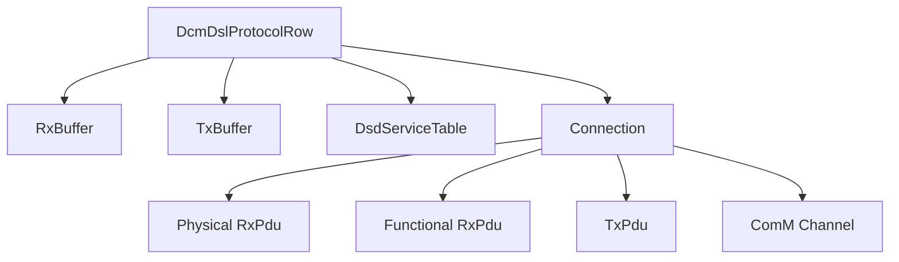
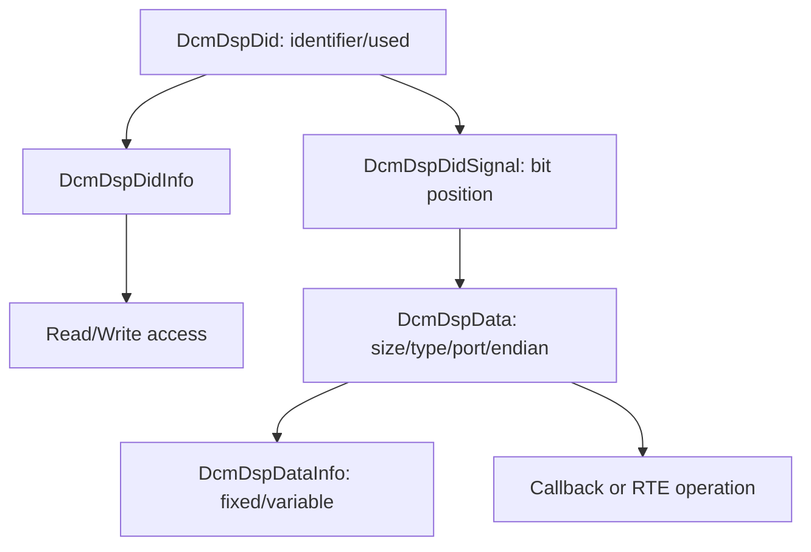

# DCM ECUC parameters — từ configuration tới runtime

Bài này đọc cấu hình DCM theo đúng hierarchy AUTOSAR/MICROSAR. Snapshot thực tế được rút từ một project Toshiba: 3 diagnostic protocol row, task 2 ms, buffer 4095 byte, 3 session, 109 DID và 8 routine. Tên PDU nội bộ đã được rút gọn.

DCM chia trách nhiệm thành ba phần logic:

- **DSL** quản lý connection, protocol, Rx/Tx buffer, session, security và P2/P2*/S3.
- **DSD** nhận request hoàn chỉnh, tìm SID/subfunction trong service table, authorize và dispatch.
- **DSP** hiện thực service như DID, RID, DTC, reset và gọi callback/RTE/DEM.

```text
PduR → DSL(connection/timing) → DSD(service/access) → DSP(data/routine/DEM)
```

## 1. Cách đọc một ECUC container

```xml
<ECUC-CONTAINER-VALUE>
  <SHORT-NAME>DcmDspSessionRow_extended</SHORT-NAME>
  <DEFINITION-REF>.../DcmDspSessionRow</DEFINITION-REF>
  <PARAMETER-VALUES>...</PARAMETER-VALUES>
  <REFERENCE-VALUES>...</REFERENCE-VALUES>
</ECUC-CONTAINER-VALUE>
```

- `SHORT-NAME`: instance trong project.
- `DEFINITION-REF`: loại container/parameter theo vendor module definition.
- `VALUE`: literal boolean/integer/float/enum.
- `VALUE-REF`: liên kết sang container/PDU/module khác; đây là phần quan trọng nhất khi trace flow.

## 2. DcmGeneral

| Parameter | Snapshot | Runtime behavior | Sai cấu hình thường thấy |
|---|---:|---|---|
| `DcmTaskTime` | `0.002 s` | Độ phân giải state machine/timer của `Dcm_MainFunction`. | OS gọi 10 ms nhưng config 2 ms làm timeout chạy chậm hơn thiết kế. |
| `DcmMaxNumberOfThreads` | `1` | Chỉ một request active tại một thời điểm. | Request thứ hai có thể busy/reject tùy protocol. |
| `DcmDefaultEndianness` | `BIG_ENDIAN` | Default byte order cho data element không override. | Numeric DID bị đảo byte. |
| `DcmRespondAllRequest` | `true` | Không bỏ request theo legacy SID-range filter. | Không có nghĩa mọi functional error đều phải trả NRC. |
| `DcmDevErrorDetect` | `false` | Không generate/report nhiều DET development checks. | Debug API misuse khó hơn. |
| `DcmSafeBswChecks` | `true` | Bật kiểm tra phòng vệ vendor runtime. | Tăng nhẹ code/runtime nhưng chặn invalid state/index. |
| Manufacturer/Supplier notification | `true` | Cho phép notification/callout quan sát hoặc veto request. | Callback chậm làm ảnh hưởng P2. |
| `DcmResetToFblAfterSessionFinalResponse` | `true` | Gửi final response rồi mới reset/switch bootloader. | Reset quá sớm làm tester không nhận response. |
| `DcmStateRecoveryAfterReset` | `false` | Không phục hồi session/security state sau reset. | Tester phải reconnect/default-session flow. |
| `DcmSplitTasks` | `false` | Không dùng worker task riêng. | Không được tự suy diễn rằng callback chạy song song. |
| `DcmDemApiVersion` | `4.3.1` contract | Chọn API contract DCM↔DEM. | Dùng sai generated interface gây compile/link mismatch. |

## 3. DSL — buffer, protocol, connection



### Buffer

Ba client OBD, off-board UDS và on-board UDS đều có buffer `4095 byte`. Đây là kích thước **diagnostic N-SDU**, không phải CAN DLC. CanTp có thể ghép nhiều CAN frame thành request tối đa trong giới hạn buffer.

Khi sizing, lấy request/response UDS lớn nhất kể cả SID, DID/RID, record header và payload; cộng margin/alignment theo vendor. Transport có thể support message dài nhưng DCM buffer nhỏ hơn vẫn làm reception fail.

Buffer quá nhỏ dẫn đến `BUFREQ_E_OVFL`/reception abort trước khi DSD nhìn thấy SID. Buffer rất lớn làm tăng RAM và contention nếu implementation dùng shared buffer.

### Protocol row snapshot

| Row | Protocol | Priority | Connection | Rx PDU ID | Tx confirmation ID |
|---|---|---:|---:|---|---:|
| OBD | `DCM_OBD_ON_CAN` | 0 | 0 | functional 0, physical 1 | 0 |
| Off-board | `DCM_UDS_ON_CAN` | 1 | 1 | functional 2, physical 3 | 1 |
| On-board | `DCM_UDS_ON_CAN` | 2 | 2 | physical 4, functional 5 | 2 |

Tất cả dùng `NORMAL_FIXED` addressing và cùng một ComM channel. Priority dùng khi protocol cạnh tranh/preemption; không được hiểu là CAN arbitration priority. Với MICROSAR thường số nhỏ ưu tiên cao hơn, nhưng phải xác nhận đúng generator version trước khi đổi.

### Các parameter DSL quan trọng

| Parameter | Tác dụng |
|---|---|
| `DcmDslProtocolID` | Chọn UDS/OBD behavior và generated service contract. |
| `DcmDslProtocolPriority` | Arbitration giữa các protocol active. |
| `DcmDslProtocolPreemptTimeout` | Giới hạn thời gian preemption/transition. |
| Rx/Tx buffer reference | Chọn nơi DCM nhận request và tạo response. |
| Service table reference | Quyết định SID/subfunction nào reachable trên protocol. |
| `DcmDslProtocolRxPduId` | ID nội bộ DCM cho callback reception; không phải CAN ID. |
| `DcmDslTxConfirmationPduId` | Ghép TxConfirmation về đúng connection/request. |
| Tester source address | Nhận diện client trong addressing format có địa chỉ. |
| `DcmDslConnectionID` | Generated connection index. |
| ComM channel reference | DCM yêu cầu/nhả diagnostic communication mode. |

## 4. Session, P2/P2* và S3

| Session row | Value | P2ServerMax | P2StarServerMax | Boot |
|---|---:|---:|---:|---|
| default | `0x01` | 50 ms | 5 s | no boot |
| programming | `0x02` | 50 ms | 5 s | OEM boot |
| extended | `0x03` | 50 ms | 5 s | no boot |

Protocol row còn có `P2ServerAdjust=20 ms` và `P2StarServerAdjust=1 s`. Adjust là margin để DCM bắt đầu response/NRC `0x78` trước deadline công bố; không phải thay thế P2/P2* trong session row.

`DcmSessionTimerS3Enabled=true`: non-default session trở về default sau inactivity. TesterPresent restart S3 nhưng không cam kết giữ security state vô hạn.

```text
request complete
  ├─ xử lý xong trước P2 → final response
  └─ chưa xong → 7F <SID> 78 trước P2
                   └─ final/next pending trước P2*
```

## 5. DSD — service table và authorization

`DcmDsdServiceTable` được protocol row tham chiếu. Mỗi `DcmDsdService` chứa SID, processor, subfunction flag và access references. `DcmDsdSubService` tiếp tục giới hạn từng subfunction.

Snapshot có các SID `0x10`, `0x14`, `0x19`, `0x22`, `0x28`, `0x2C`, `0x2E`, `0x31`, `0x3E` tùy service table. Không thấy `0x11`, `0x27`, `0x34`, `0x36`, `0x37` trong table hiện tại.

Điểm đặc biệt: container `DcmDspSecurity` tồn tại nhưng không có SecurityRow và service `0x27` không được expose. Do đó flow seed/key của project khác không được áp vào snapshot này.

DSD kiểm tra theo thứ tự logic:

```text
SID/subfunction → session → security → mode rule/condition → DSP handler
```

Service có trong DSP nhưng không nằm trong active service table vẫn không thể gọi từ tester.

## 6. DSP DID hierarchy



| Parameter | Ý nghĩa |
|---|---|
| `DcmDspDidIdentifier` | DID 16-bit mà tester đặt sau SID. |
| `DcmDspDidUsed` | Enable DID trong generated configuration. |
| `DcmDspDidSignalPos` | Bit offset của data element trong DID record. |
| `DcmDspDataSize` | Kích thước thường tính bằng bit, không mặc định là byte. |
| `DcmDspDataType` | Kiểu generated interface như UINT8/UINT16/array. |
| `DcmDspDataEndianness` | Cách serialize numeric multi-byte value. |
| `DcmDspDataUsePort` | Function call, client-server, sender-receiver hoặc vendor mode. |
| `DcmDspDataFixedLength` | Fixed length hay callback cung cấp length runtime. |
| ConditionCheckRead | Kiểm tra điều kiện trước khi gọi read. |
| Read/Write session refs | Session authorization ở DID operation level. |
| Read/Write security refs | Security authorization ở DID operation level. |

Ví dụ thực tế `DID 0xF188`: data size `216 bit = 27 byte`, `UINT8`, big-endian, fixed length, synchronous client-server. Flow `22 F1 88` là DSD tìm `0x22` → DSP tìm DID → check access → gọi read operation → tạo `62 F1 88 + 27 bytes`.

## 7. DSP Routine

Snapshot có 8 RID: `D100`, `110B`, `D111`, `D1D1`, `D000`, `D001`, `D002`, `D1D0`.

Routine configuration phải mô tả riêng Start/Stop/RequestResults, option/status record và callback. Có Start không đồng nghĩa tự động support Stop/Results. Routine async cần state machine và `DCM_E_PENDING`; session change/reset/cancel phải được xử lý rõ.

## 8. Review checklist

1. Trace `CanTp NSdu → PduR route → Dcm RxPduId → connection → protocol row`.
2. Kiểm tra unique handle/index nhưng không so sánh numeric ID giữa namespace module.
3. Buffer đủ request và response lớn nhất.
4. P2/P2*/S3 phù hợp callback worst-case và tester expectation.
5. SID/subfunction có trong đúng service table.
6. DID/RID access refs đúng session/security/mode.
7. Data size, signal position, endian và callback signature nhất quán.
8. Test positive, wrong length, wrong session, wrong security, out-of-range, pending, cancel và TxConfirmation failure.
