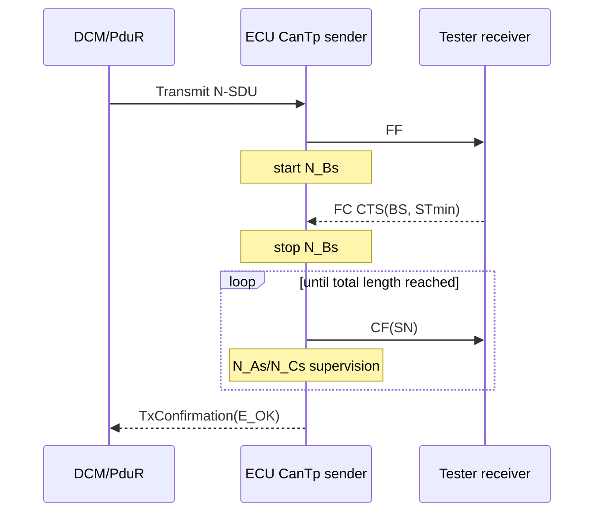
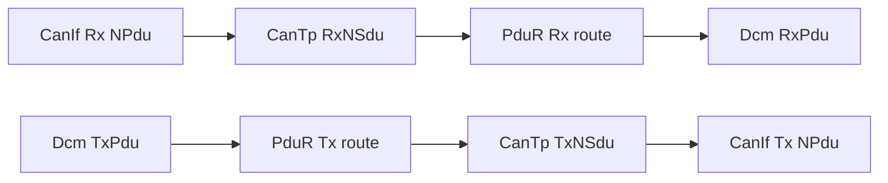

# Diagnostic transport stack — CanIf, CanTp, PduR và RX/TX flow

Snapshot Toshiba có 6 half-duplex channel: 3 physical TxNSdu và 6 RxNSdu (physical + functional cho OBD/off-board/on-board). Diagnostic payload dùng 8 byte, Normal Fixed Addressing và padding `0xCC`.

## 1. ISO-TP frame types

| Frame | PCI nibble | Vai trò |
|---|---:|---|
| Single Frame (SF) | `0x0` | Chứa toàn bộ N-SDU ngắn trong một CAN frame. |
| First Frame (FF) | `0x1` | Mở multi-frame và công bố total message length. |
| Consecutive Frame (CF) | `0x2` | Mang phần data tiếp theo cùng sequence number 0…15 quay vòng. |
| Flow Control (FC) | `0x3` | Receiver trả CTS/WAIT/OVERFLOW cùng BS và STmin. |

FF/CF/FC là transport frame, không phải UDS request riêng. Kết thúc reception dựa total length và số byte đã copy, không dựa “SN cuối”.

## 2. Hierarchy

```text
CanTpConfig
 └─ CanTpChannel
     ├─ CanTpRxNSdu
     │   ├─ RxNPdu       data SF/FF/CF từ CanIf
     │   └─ TxFcNPdu     FC từ ECU về tester
     └─ CanTpTxNSdu
         ├─ TxNPdu       data SF/FF/CF từ ECU
         └─ RxFcNPdu     FC từ tester về ECU
```

`NSdu` là message transport-level nối với PduR/DCM. `NPdu` là CAN-frame-level PDU nối với CanIf. Đổi direction sai khiến request có thể vào được nhưng response multi-frame không chạy.

## 3. General parameters

| Parameter | Snapshot | Tác động runtime |
|---|---:|---|
| `CanTpPaddingActive` | true | Bật padding policy toàn module. |
| `CanTpHavePaddingByte` | true | Generate configurable padding byte. |
| `CanTpPaddingByte` | `204 = 0xCC` | Byte điền phần dư của CAN frame. |
| `CanTpFlexibleDataRateSupport` | false | Transport hiện không dùng CAN FD payload. |
| `CanTpSupportNormalFixedAddressing` | true | Format đang dùng cho các NSdu. |
| Standard addressing support | true | Binary có support nhưng NSdu hiện tại chọn Normal Fixed. |
| Mixed11/Mixed29/Extended/Custom | false | Không generate handling cho các format này. |
| `CanTpEnableSplitMainFunction` | true | Vendor cho phép tách Rx/Tx cyclic processing. |
| `CanTpEnableConstantBS` | true | Receiver dùng BS theo cấu hình ổn định. |
| `CanTpUseOnlyFirstFc` | true | Tx sử dụng thông tin FC đầu tiên theo vendor behavior. |
| `CanTpEnableTransmitQueue` | false | Không có queue Tx bổ sung trong CanTp. |
| `CanTpRxWftMax` | 0 | Receiver không phát FC.WAIT. |

Tên CAN network có chữ CANFD nhưng `RxDl=8`, `TxDl=8`, FD support false. Phải đọc parameter, không suy luận từ tên bus.

## 4. Channel

`CanTpChannelMode=CANTP_MODE_HALF_DUPLEX`: một channel không thực hiện Rx và Tx data transfer đồng thời. Điều này tiết kiệm resource nhưng ảnh hưởng concurrency. Full duplex chỉ nên dùng khi requirement và buffer/state machine support.

`CanTpChannelLowerLayer=CANTP_LOWER_LAYER_CANIF`: các NPdu đi qua CanIf. Reference xuống CanIf quyết định CAN ID/HRH/HTH thực tế.

## 5. RxNSdu — ECU nhận diagnostic request

| Parameter | Snapshot | Ý nghĩa |
|---|---:|---|
| `CanTpRxNSduId` | 0…5 | Handle nội bộ do PduR/CanTp dùng; không phải CAN ID. |
| `CanTpRxAddressingFormat` | `NORMALFIXED` | Target/source address được suy từ network addressing/CAN ID mapping. |
| `CanTpRxTaType` | physical/functional | Ảnh hưởng rule response và multi-frame functional handling. |
| `CanTpRxDl` | 8 | CAN payload length dùng cho transport. |
| `CanTpRxPaddingActivation` | ON | Validate/expect padding theo configuration. |
| `CanTpBs` | 0 | FC.CTS cho sender gửi toàn bộ CF còn lại không cần FC tiếp. |
| `CanTpSTmin` | 0 | ECU không yêu cầu gap bổ sung giữa CF từ tester. |
| `CanTpRxWftMax` | 0 | Không sử dụng FC.WAIT. |
| `CanTpNbr` | 0.9 s | Receiver phải chuẩn bị buffer/FC trong giới hạn. |
| `CanTpNcr` | 1.4 s | Sau FC/CF, receiver chờ CF kế tiếp. |
| `CanTpNar` | 1.4 s | Chờ confirmation khi ECU phát FC. |

`BS=0` không nghĩa chỉ gửi zero CF; nó nghĩa “không giới hạn block cho phần còn lại”. End-of-message được xác định từ total length trong FF và số byte đã nhận, không từ một SN đặc biệt.

## 6. TxNSdu — ECU gửi diagnostic response

| Parameter | Snapshot | Ý nghĩa |
|---|---:|---|
| `CanTpTxNSduId` | 0…2 | Handle nội bộ cho ba physical response path. |
| `CanTpTxAddressingFormat` | `NORMALFIXED` | Cách tạo/giải nghĩa addressing. |
| `CanTpTxTaType` | physical | Response đi về một tester cụ thể. |
| `CanTpTxDl` | 8 | SF/FF/CF dùng payload 8 byte. |
| `CanTpTxPaddingActivation` | ON | Pad frame bằng `0xCC`. |
| `CanTpNas` | 1.4 s | Chờ CanIf TxConfirmation cho frame data. |
| `CanTpNbs` | 1.4 s | Sau FF hoặc hết block, chờ FC từ tester. |
| `CanTpNcs` | 0.15 s | Chuẩn bị/cung cấp CF tiếp theo đúng hạn. |
| `CanTpTc` | true | Vendor feature/optimization cho transmission confirmation path. |

## 7. Timer flow



Timer được kiểm tra theo tick main function. Nếu config 2 ms nhưng OS gọi 10 ms, effective timeout/spacing bị lượng tử hóa sai. Timer phải lớn hơn worst-case scheduling + CanIf/controller latency + margin.

## 8. Padding

CanTp tạo padding ở Tx và loại bỏ phần padding khi giao N-SDU lên PduR. Receiver dựa PCI/total length, không tìm byte `0xCC` để đoán điểm kết thúc. Nếu ECU bật Rx padding validation nhưng tester gửi DLC/byte padding không đúng policy, CanTp có thể abort trước DCM.

Padding không chỉ dành cho CAN FD. Classic CAN diagnostic cũng thường pad frame tới 8 byte theo network/OEM/ISO profile. CAN FD chỉ thêm các payload length hợp lệ lớn hơn 8.

## 9. Failure mapping

| Lỗi | Module phát hiện | Kết quả |
|---|---|---|
| Wrong CF sequence number | CanTp | Abort reception; DCM không nhận request hoàn chỉnh. |
| N_Cr timeout | CanTp | Abort Rx N-SDU. |
| N_Bs timeout | CanTp | Abort Tx response vì tester không gửi FC. |
| Buffer overflow từ PduR/DCM | CanTp/PduR | Abort với buffer request failure. |
| Padding/length violation | CanTp | Reject/abort theo config. |
| Unsupported SID | DCM | UDS NRC, vì transport đã hoàn tất. |

## 10. Review checklist

Trace đủ hai chiều: `CanIf RxNPdu → CanTp RxNSdu → PduR → DCM` và `DCM → PduR → CanTp TxNSdu → CanIf TxNPdu`. Test SF, FF/FC/CF, BS=0, STmin, wrong SN, missing FC, missing CF, padding, boundary buffer và confirmation failure.

## 11. PduR trong diagnostic path

PduR không hiểu SID, DID, NRC hay ISO-TP PCI. Nó nối API và PDU reference giữa CanTp và DCM.



| PduR parameter | Snapshot | Ý nghĩa |
|---|---:|---|
| `PduRSourcePduHandleId` | generated index | Tra route; không phải CAN ID hoặc CanTp NSduId. |
| `PduRSrcPduDirection` | RX/TX | Hướng của PDU tại source module. |
| `PduRSrcPduRef` | EcuC PDU ref | Nối đúng source PDU instance. |
| Source BSW module ref | CanTp/DCM | Chọn generated adapter API. |
| `PduRDestPduHandleId` | generated index | Index destination table. |
| `PduRDestPduRoutingType` | `API_FORWARDING` | Forward bằng API, không gateway-buffer processing. |
| `PduRDestPduDataProcessing` | `IMMEDIATE` | Gọi destination path ngay. |
| length strategy | `UNUSED` | Không dùng IF length adaptation. |
| cross-partition destination | false | Không qua partition bridge. |

Snapshot có 6 Rx route: functional + physical cho OBD, off-board và on-board; có 3 physical Tx response route. Functional request vẫn response bằng physical Tx path.

Với TP message, PduR nối chuỗi API chứ không tự assemble message:

```text
RX: CanTp_StartOfReception → PduR → Dcm_StartOfReception
    CanTp_CopyRxData       → PduR → Dcm_CopyRxData
    CanTp_RxIndication     → PduR → Dcm_TpRxIndication

TX: Dcm_Transmit           → PduR → CanTp_Transmit
    CanTp_CopyTxData       → PduR → Dcm_CopyTxData
    CanTp_TxConfirmation   → PduR → Dcm_TpTxConfirmation
```

## 12. Full RX/TX flow

```text
RX: CAN → CanIf → CanTp reassembly → PduR → DCM DSL → DSD → DSP
TX: DSP → DSD/DSL → PduR → CanTp segmentation → CanIf → CAN
```

Nếu CAN trace không có frame thì bắt đầu ở CanIf/controller; có FF nhưng không có CF thì kiểm tra FC/N_Bs; đủ request nhưng không response thì trace PduR→DCM service table/access/callback.
