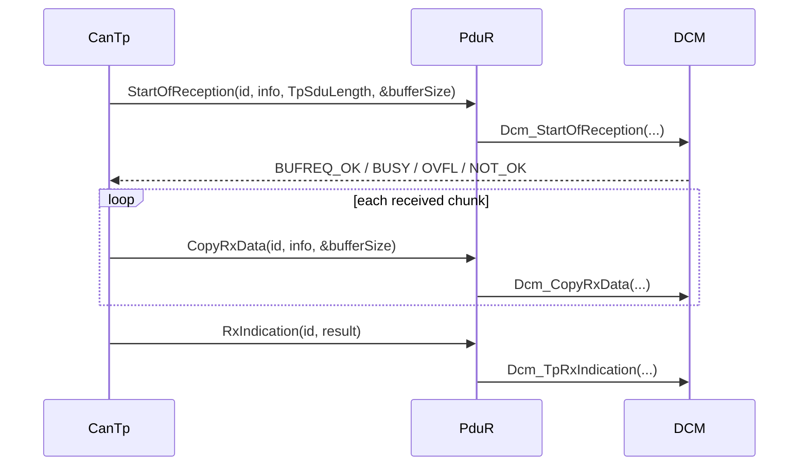

# AUTOSAR Diagnostic APIs — ai gọi, khi nào và parameter có nghĩa gì?

Tên/signature chi tiết có thể khác theo AUTOSAR release/vendor feature. Luôn kiểm tra SWS/configuration của project; phần này dạy contract và call direction.

## Initialization và cyclic processing

| API | Caller điển hình | Ý nghĩa |
|---|---|---|
| `Dcm_InitMemory()` | EcuM/init list | đưa biến module về state trước init |
| `Dcm_Init(config)` | EcuM | nạp configuration, init DSL/DSD/DSP |
| `Dcm_MainFunction()` | SchM/OS cyclic task | tiến protocol, service, session và timer state machine |
| `CanTp_Init(config)` | EcuM | init channel/NSdu configuration |
| `CanTp_MainFunction()` | SchM cyclic | xử lý timer, FC/CF scheduling, timeout |
| `Dem_PreInit(config)` | early startup | cho phép event report sớm trước full init |
| `Dem_Init(config)` | EcuM | init event memory/status/config |
| `Dem_MainFunction()` | SchM | async event/Nv processing tùy implementation |

`config` có thể là pointer post-build hoặc macro/NULL theo variant. Không tự đoán; generated `*_Cfg.h` quyết định usage.

## Upper-layer buffer callbacks

### Parameters

- `id`: configured N-SDU/PDU identity, không phải CAN ID hay UDS SID.
- `PduInfoType.SduDataPtr`: pointer chunk data; lifetime chỉ trong call.
- `SduLength`: số byte trong chunk hiện tại.
- `TpSduLength`: total message length từ FF/SF metadata.
- `bufferSizePtr`: upper layer trả remaining/available buffer.
- `result`: `E_OK` chỉ khi complete transport; failure nghĩa DCM không xử lý partial request.

`BUFREQ_E_OVFL` nghĩa total message vượt buffer; `BUFREQ_E_BUSY` có thể yêu cầu retry tùy API/transport contract; `BUFREQ_E_NOT_OK` là reject.

## TX buffer callbacks

DCM gọi `PduR_DcmTransmit(TxPduId, PduInfo)` để yêu cầu response. CanTp sau đó gọi `CopyTxData` qua PduR nhiều lần để lấy SF/FF/CF chunks. `retry` parameter hỗ trợ transport đọc lại data khi cần; `availableDataPtr` báo số byte còn. `TpTxConfirmation` kết thúc transaction và cho DCM release buffer/state.

Không được sửa/free response buffer khi transport chưa confirmation.

## CanTp lower callbacks

- `CanTp_RxIndication(RxPduId, PduInfoPtr)`: CanIf báo một CAN L-PDU đã nhận.
- `CanTp_TxConfirmation(TxPduId, result)`: CanIf báo một frame truyền xong/fail.
- `CanTp_Transmit(TxSduId, PduInfoPtr)`: upper/PduR yêu cầu gửi N-SDU.
- `CanTp_CancelTransmit/CancelReceive`: hủy channel nếu config hỗ trợ.
- `CanTp_ChangeParameter/ReadParameter`: thay/đọc BS hoặc STmin khi feature hỗ trợ.

CanTp `RxIndication` là từng CAN frame từ CanIf; DCM `TpRxIndication` là toàn N-SDU complete. Hai API cùng chữ indication nhưng khác layer và granularity.

## DEM monitor APIs

`Dem_SetEventStatus(EventId, EventStatus)` là API quan trọng: monitor báo PASSED/FAILED/PREFAILED/PREPASSED. `EventId` là symbolic generated identifier, không phải 3-byte DTC. Return code cho biết request accept theo state/config, không tự đồng nghĩa DTC đã được store Nv memory.

Các query/control API cho event status, debounce, operation cycle, enable condition và DCM-facing DTC selection/filter/data retrieval phụ thuộc release. DCM service `0x19` dùng DEM client interface/state machine để select/filter/read DTC, snapshot và extended data; application không nên tự đọc private DEM memory.

## Context và reentrancy

Ghi rõ API chạy init/task/ISR context, synchronous hay asynchronous, reentrant theo PDU/event khác hay không. Callback dài trong reception path làm tăng latency. Protected critical section chỉ bảo vệ shared state ngắn; không gọi NvM blocking hoặc algorithm dài từ low-level callback.

Nguồn: [AUTOSAR DCM SWS R24-11](https://www.autosar.org/fileadmin/standards/R24-11/CP/AUTOSAR_CP_SWS_DiagnosticCommunicationManager.pdf), [AUTOSAR DEM SWS](https://www.autosar.org/fileadmin/standards/R20-11/CP/AUTOSAR_SWS_DiagnosticEventManager.pdf).
