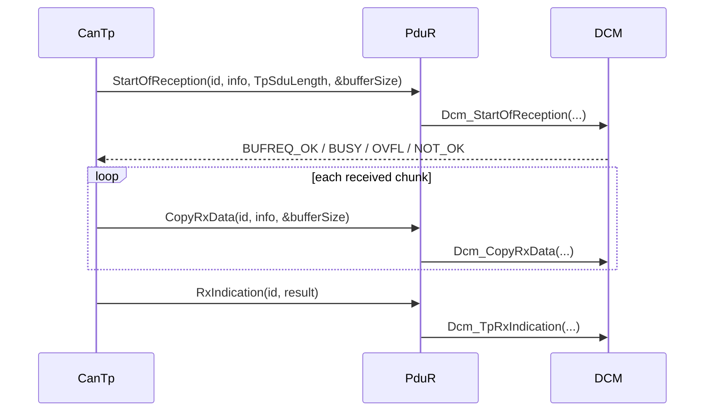

# AUTOSAR Diagnostic APIs — ai gọi, khi nào và parameter có nghĩa gì?

Tên/signature chi tiết có thể khác theo AUTOSAR release/vendor feature. Luôn kiểm tra SWS/configuration của project; phần này dạy contract và call direction.

## Initialization và cyclic processing

| API | Caller điển hình | Ý nghĩa |
|---|---|---|
| `Dcm_InitMemory()` | EcuM/init list | đưa biến module về state trước init |
| `Dcm_Init(config)` | EcuM | nạp configuration, init DSL/DSD/DSP |
| `Dcm_MainFunction()` | SchM/OS cyclic task | tiến protocol, service, session và timer state machine |
| `CanTp_Init(config)` | EcuM | init channel/NSdu configuration |
| `CanTp_MainFunction()` | SchM cyclic | xử lý timer, FC/CF scheduling, timeout |
| `Dem_PreInit(config)` | early startup | cho phép event report sớm trước full init |
| `Dem_Init(config)` | EcuM | init event memory/status/config |
| `Dem_MainFunction()` | SchM | async event/Nv processing tùy implementation |

`config` có thể là pointer post-build hoặc macro/NULL theo variant. Không tự đoán; generated `*_Cfg.h` quyết định usage.

## Upper-layer buffer callbacks



### Parameters

- `id`: configured N-SDU/PDU identity, không phải CAN ID hay UDS SID.
- `PduInfoType.SduDataPtr`: pointer chunk data; lifetime chỉ trong call.
- `SduLength`: số byte trong chunk hiện tại.
- `TpSduLength`: total message length từ FF/SF metadata.
- `bufferSizePtr`: upper layer trả remaining/available buffer.
- `result`: `E_OK` chỉ khi complete transport; failure nghĩa DCM không xử lý partial request.

`BUFREQ_E_OVFL` nghĩa total message vượt buffer; `BUFREQ_E_BUSY` có thể yêu cầu retry tùy API/transport contract; `BUFREQ_E_NOT_OK` là reject.

## TX buffer callbacks

DCM gọi `PduR_DcmTransmit(TxPduId, PduInfo)` để yêu cầu response. CanTp sau đó gọi `CopyTxData` qua PduR nhiều lần để lấy SF/FF/CF chunks. `retry` parameter hỗ trợ transport đọc lại data khi cần; `availableDataPtr` báo số byte còn. `TpTxConfirmation` kết thúc transaction và cho DCM release buffer/state.

Không được sửa/free response buffer khi transport chưa confirmation.

## CanTp lower callbacks

- `CanTp_RxIndication(RxPduId, PduInfoPtr)`: CanIf báo một CAN L-PDU đã nhận.
- `CanTp_TxConfirmation(TxPduId, result)`: CanIf báo một frame truyền xong/fail.
- `CanTp_Transmit(TxSduId, PduInfoPtr)`: upper/PduR yêu cầu gửi N-SDU.
- `CanTp_CancelTransmit/CancelReceive`: hủy channel nếu config hỗ trợ.
- `CanTp_ChangeParameter/ReadParameter`: thay/đọc BS hoặc STmin khi feature hỗ trợ.

CanTp `RxIndication` là từng CAN frame từ CanIf; DCM `TpRxIndication` là toàn N-SDU complete. Hai API cùng chữ indication nhưng khác layer và granularity.

## DEM monitor APIs

`Dem_SetEventStatus(EventId, EventStatus)` là API quan trọng: monitor báo PASSED/FAILED/PREFAILED/PREPASSED. `EventId` là symbolic generated identifier, không phải 3-byte DTC. Return code cho biết request accept theo state/config, không tự đồng nghĩa DTC đã được store Nv memory.

Các query/control API cho event status, debounce, operation cycle, enable condition và DCM-facing DTC selection/filter/data retrieval phụ thuộc release. DCM service `0x19` dùng DEM client interface/state machine để select/filter/read DTC, snapshot và extended data; application không nên tự đọc private DEM memory.

## Context và reentrancy

Ghi rõ API chạy init/task/ISR context, synchronous hay asynchronous, reentrant theo PDU/event khác hay không. Callback dài trong reception path làm tăng latency. Protected critical section chỉ bảo vệ shared state ngắn; không gọi NvM blocking hoặc algorithm dài từ low-level callback.

Nguồn: [AUTOSAR DCM SWS R24-11](https://www.autosar.org/fileadmin/standards/R24-11/CP/AUTOSAR_CP_SWS_DiagnosticCommunicationManager.pdf), [AUTOSAR DEM SWS](https://www.autosar.org/fileadmin/standards/R20-11/CP/AUTOSAR_SWS_DiagnosticEventManager.pdf).

## API map theo call direction

| Boundary | API family | Caller → callee | Mục đích |
|---|---|---|---|
| CAN RX | `CanTp_RxIndication` | CanIf → CanTp | Giao từng CAN frame. |
| CAN TX | `CanIf_Transmit`, `CanTp_TxConfirmation` | CanTp ↔ CanIf | Phát và confirm SF/FF/CF/FC. |
| TP RX | `StartOfReception`, `CopyRxData`, `TpRxIndication` | CanTp → PduR → DCM | Buffer/reassemble N-SDU. |
| TP TX | `PduR_DcmTransmit`, `CanTp_Transmit`, `CopyTxData`, `TpTxConfirmation` | DCM ↔ PduR ↔ CanTp | Segment response và quản lý lifetime. |
| DCM data | DID/RID RTE operations | DSP → RTE/application | Đọc/ghi data, chạy routine. |
| Fault monitor | `Dem_SetEventStatus` | SWC/BSW → DEM | Báo monitor result. |
| DTC service | select/filter/get-next/data/clear | DCM → DEM | Hiện thực `0x14/0x19`. |
| Persistence | `NvM_ReadBlock/WriteBlock/GetErrorStatus` | application/service → NvM | Lưu coding/event data. |

## DCM callback contracts

```c
Std_ReturnType Diag_ReadData(Dcm_OpStatusType opStatus, uint8 *data);
Std_ReturnType Diag_ReadDataLength(uint16 *length);
Std_ReturnType Diag_WriteData(const uint8 *data, Dcm_OpStatusType opStatus,
                              Dcm_NegativeResponseCodeType *nrc);
Std_ReturnType Routine_Start(const uint8 *in, Dcm_OpStatusType opStatus,
                             uint8 *out, uint16 *outLength,
                             Dcm_NegativeResponseCodeType *nrc);
```

- `data` là DCM-owned buffer; callback ghi đúng configured length và không giữ pointer sau call.
- `opStatus` mô tả lifecycle `INITIAL/PENDING/CANCEL`, không phải service result.
- `E_OK` là complete; pending return yêu cầu DCM gọi lại và quản lý NRC `0x78`.
- `E_NOT_OK` cần NRC chính xác; không mặc định mọi lỗi là `0x22`.
- Start/Stop/RequestResults là callback riêng; cancel phải release resource.

## DEM API groups

- Monitor: `Dem_SetEventStatus`, reset/query debounce.
- Cycle/condition: set operation-cycle state, enable/storage/availability nếu configured.
- Event query: UDS status, failed/tested/FDC và data APIs tùy release.
- DCM client: select DTC, filter, count/get-next, snapshot/extended record, clear và poll clear result.

DEM filter thường stateful theo `DemClientId`; không dùng chung một client context đồng thời nếu configuration không cho phép.

## NvM asynchronous pattern

```c
if (opStatus == DCM_INITIAL) {
    if (!Coding_IsValid(data)) { *nrc = DCM_E_REQUESTOUTOFRANGE; return E_NOT_OK; }
    memcpy(codingMirror, data, CODING_SIZE);
    if (NvM_WriteBlock(CODING_BLOCK, codingMirror) != E_OK) {
        *nrc = DCM_E_GENERALPROGRAMMINGFAILURE;
        return E_NOT_OK;
    }
    return DCM_E_PENDING;
}

(void)NvM_GetErrorStatus(CODING_BLOCK, &jobResult);
if (jobResult == NVM_REQ_PENDING) return DCM_E_PENDING;
if (jobResult == NVM_REQ_OK) return E_OK;
*nrc = DCM_E_GENERALPROGRAMMINGFAILURE;
return E_NOT_OK;
```

Đây là teaching pattern; exact signature/return macro phụ thuộc generated interface.

## Init order quan sát trong Toshiba snapshot

```text
NvM_Init → NvM_ReadAll
 → CanIf_Init → CanTp_Init → PduR_Init
 → Dcm_Init → ComM_Init → Dem_Init
```

Lower communication layer phải sẵn trước DCM nhận request; NvM mirror phải được chuẩn bị trước khi DID/coding dùng; DEM pre-init/full-init policy phải hỗ trợ early event. Project khác có thể chia init list khác, nên đọc BswM/EcuM generated action list.

## Parameter semantics nhanh

- `PduIdType`: module-local index, không phải CAN ID.
- `PduInfoType`: pointer và length của frame/chunk hiện tại.
- `BufReq_ReturnType`: buffer negotiation result, khác `Std_ReturnType`.
- `Dcm_NegativeResponseCodeType *`: output NRC khi callback fail.
- `Dem_EventIdType`: symbolic internal event handle, khác DTC 3 byte.
