# UDS use cases thực tế — từ tester tới application

Chương này dùng CAN ID giả lập `0x7E0` (tester→ECU) và `0x7E8` (ECU→tester). DID/RID variant là dữ liệu học tập, không phải cấu hình OEM. Mỗi flow tách ba lớp:

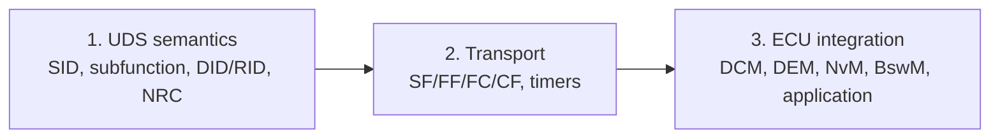

## 0. Luồng chung của một request

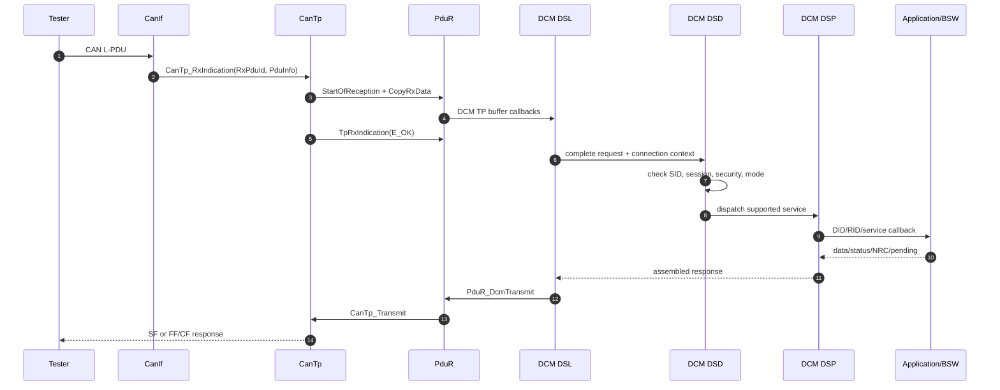

Nếu CanTp chưa hoàn thành N-SDU, DCM chưa nhìn thấy SID. Vì vậy mất CF/timer transport thường không tạo UDS NRC; tester chỉ thấy timeout.

---

## 1. Đọc VIN bằng `22 F1 90`

### Mục đích

VIN là chuỗi 17 ký tự dùng nhận diện xe. Tester workshop, manufacturing hoặc service tool thường đọc VIN để chọn dataset/variant và gắn log với đúng xe.

### Request UDS

```text
22 F1 90
│  └──┴── DID F190 = VIN
└──────── SID ReadDataByIdentifier
```

Request 3 byte vừa một Single Frame:

```text
CAN 0x7E0 DLC=8: 03 22 F1 90 00 00 00 00
                   │  └──── payload ────┘
                   └ length = 3
```

### Response multi-frame

Positive UDS payload dài `1 + 2 + 17 = 20` byte:

```text
62 F1 90 54 52 41 49 4E 49 4E 47 56 49 4E 30 30 30 30 30 31
│  │  │  └──────────────── "TRAININGVIN000001" ──────────────
│  └──┴── DID echo
└──────── positive SID = 0x22 + 0x40
```

Classic CAN ISO-TP example:

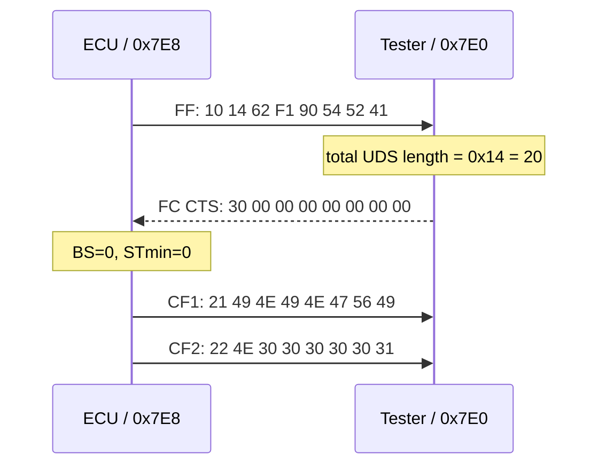

`FF` chứa 6 byte đầu; CF1/CF2 mang phần còn lại. PCI/length không thuộc UDS payload và không được đưa vào DID callback.

### Flow bên trong DCM

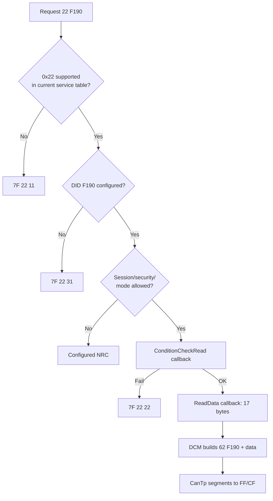

### Configuration cần có

- DSD service entry `0x22` reachable từ protocol row.
- `DcmDspDid` identifier F190, read access, fixed length.
- `DcmDspData` size 17 byte, read callback/RTE operation.
- Default/extended session references và security policy.
- DCM response buffer tối thiểu 20 byte.
- DCM TxPdu → PduR → CanTp TxNSdu → CanIf TxPdu route.

### Test matrix

| Case | Request/condition | Expected |
|---|---|---|
| positive | `22 F1 90` | exactly 17 VIN ASCII bytes |
| wrong length | `22 F1` | `7F 22 13` |
| unknown DID | `22 F1 91` | `7F 22 31` |
| callback unavailable | data source invalid | `7F 22 22` or configured behavior |
| no FC after FF | tester transport fault | ECU abort after N_Bs; no complete response |
| wrong CF sequence | transport corruption | receiver rejects; DCM payload not delivered |

---

## 2. Write variant DID `2E F1 A0`

### Synthetic requirement

Ba byte coding: driver side `0..1`, powertrain `0..2`, transmission `0..1`. Write chỉ ở extended session, security level 1 và safe vehicle condition. Dữ liệu phải persist qua reset.

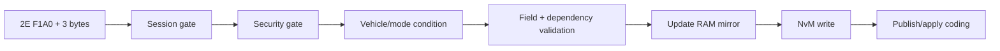

### End-to-end sequence

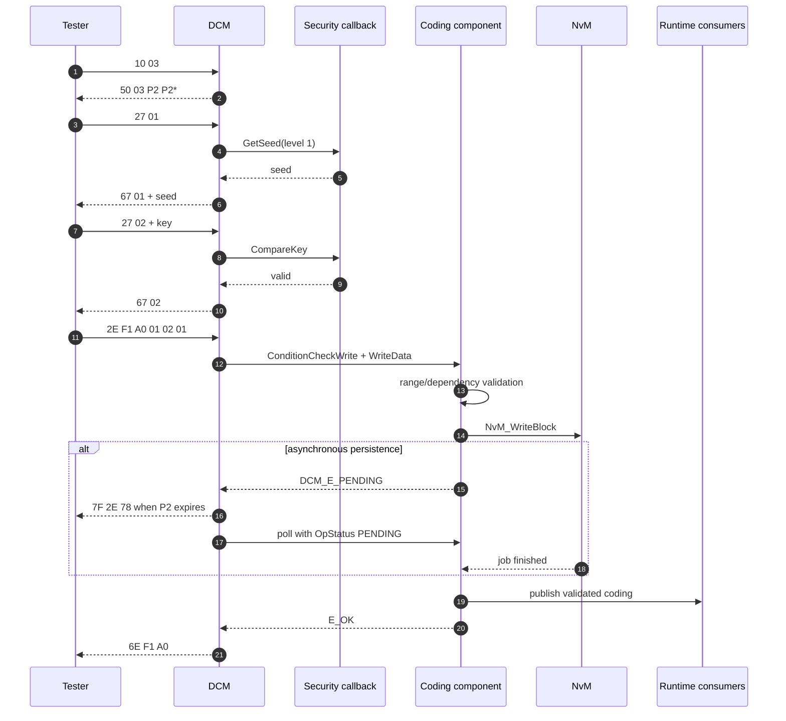

### RAM, NvM và positive response

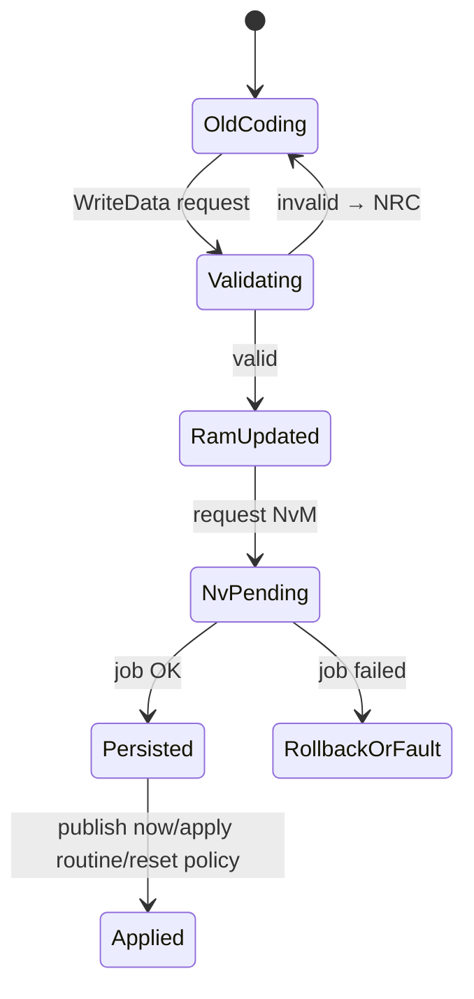

Không có một rule universal rằng DCM phải đợi NvM. Requirement quyết định completion semantics. Nếu positive response hứa “stored successfully”, callback phải chỉ trả `E_OK` sau khi lower job complete hoặc có transaction design tương đương.

### NRC decision tree

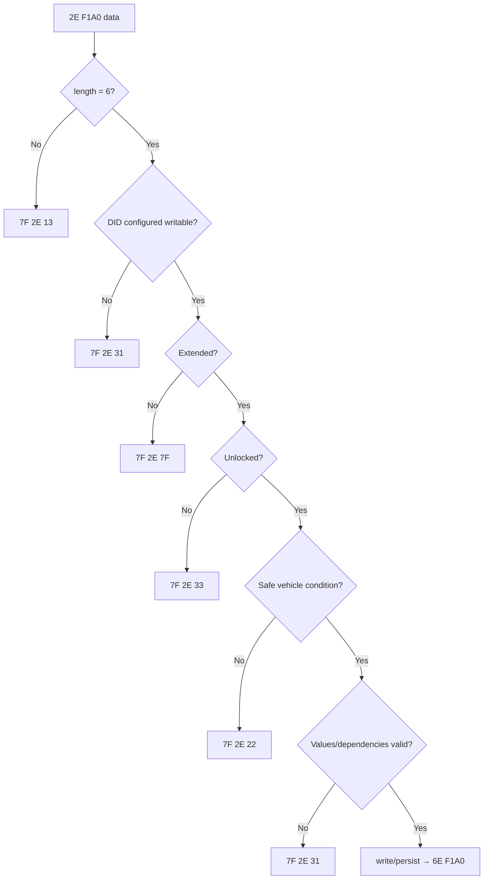

### Verification sau write

Read back trước reset chỉ chứng minh RAM mirror. Muốn chứng minh persistence:

```text
2E F1 A0 01 02 01 → positive
22 F1 A0          → verify runtime/RAM
11 01             → hard reset
wait boot/reconnect
22 F1 A0          → verify restored NvM value
verify application output/NMSG behavior
```

---

## 3. Hard Reset `11 01`

### Vì sao không reset ngay khi nhận request?

Nếu MCU reset trước khi response được gửi/confirmed, tester chỉ thấy timeout. DCM/BswM/EcuM phải phối hợp delayed reset.

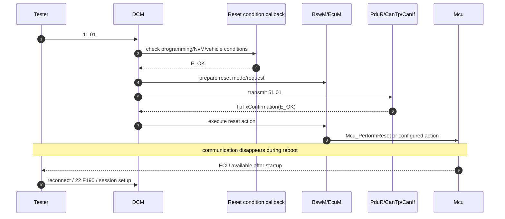

### Reset state impact

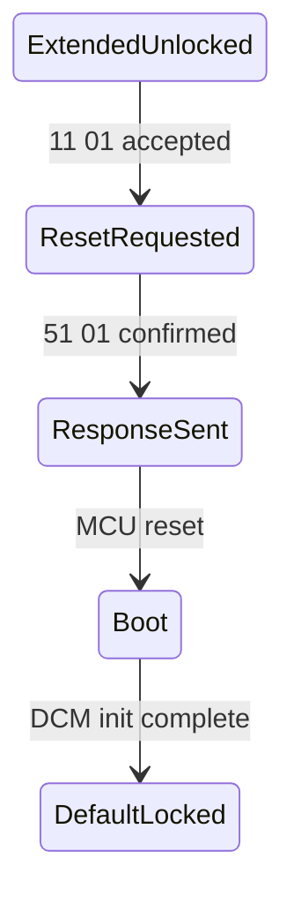

Sau reset, session thường default và security locked. NvM persistent data còn; RAM state và seed/security state được reinitialize. Reset reason có thể được lưu/đọc theo project requirement.

### Negative/edge cases

- `11 02` không configured → `7F 11 12`.
- vehicle moving/NvM critical job → `7F 11 22`.
- session không cho phép → `7F 11 7F`.
- response Tx failure: project policy quyết định cancel reset hay reset sau timeout.
- suppress-positive-response: chỉ dùng nếu service/config cho phép và reset behavior được tester biết.

---

## 4. TesterPresent `3E 00` và S3 timer

### Timeline

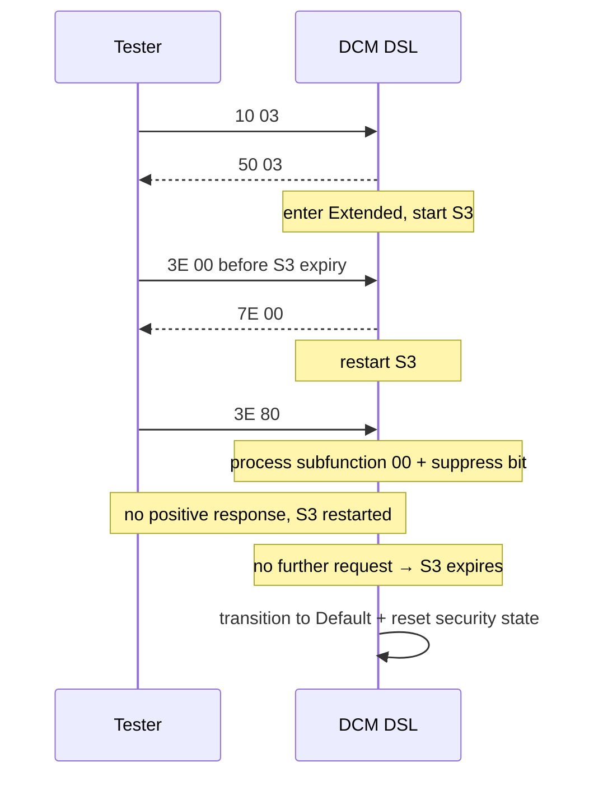

`0x80` là suppress-positive-response bit, effective subfunction vẫn `0x00`. Negative response vẫn có thể được gửi nếu request invalid theo protocol rule; suppress bit không phải “mute mọi lỗi”.

Tester interval phải có margin dưới S3, tính cả scheduling/network jitter. Gửi quá nhanh tạo bus load vô ích; quá chậm làm session rơi về default.

---

## 5. ReadDTCInformation `0x19`

### DTC status path từ monitor tới tester

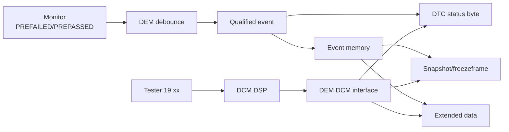

### `19 02` report DTC by status mask

```text
Request:  19 02 08
          │  │  └ requested status mask, example confirmedDTC
          │  └ reportDTCByStatusMask
          └ ReadDTCInformation

Response: 59 02 <availabilityMask> <DTC1:3 bytes> <status1> ...
```

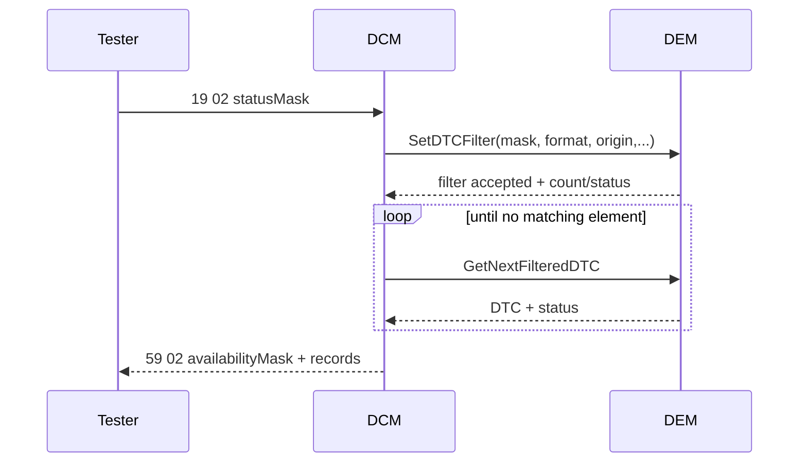

Vendor/release API names may differ, nhưng concept select/filter/iterate là cốt lõi. DCM không scan raw NvM.

### Snapshot và extended data

`19 04`/`19 06`-style requests chọn DTC và record. Snapshot là data tại trigger capture; extended data là counters/state configured. Record number `0xFF` có special meaning tùy subfunction/spec. Test unknown DTC, wrong record, memory origin và response multi-frame.

### Status byte interpretation

Tester phải AND requested mask với availability mask. `testFailed`, pending, confirmed, notCompleted, sinceLastClear và warningIndicatorRequested có lifecycle khác. Confirmed không tự clear khi current test passes; aging/clear policy xử lý.

---

## 6. RoutineControl `0x31`

### State machine

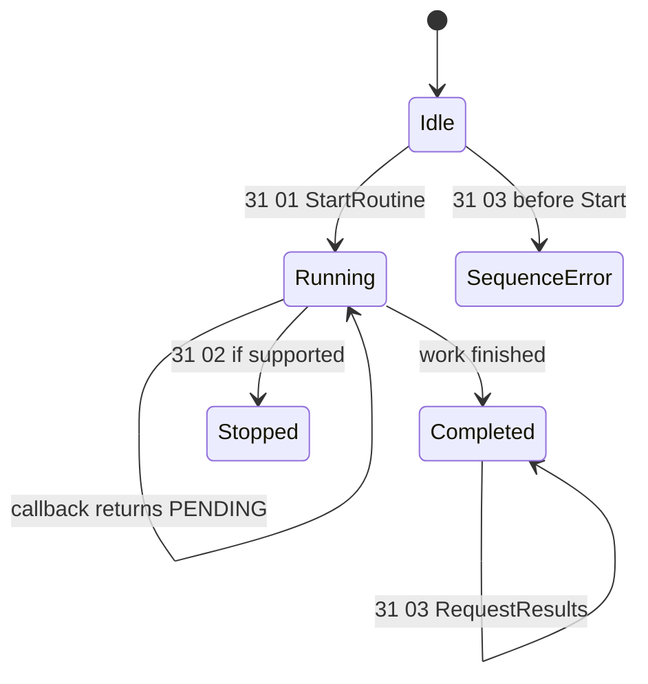

### Async routine flow

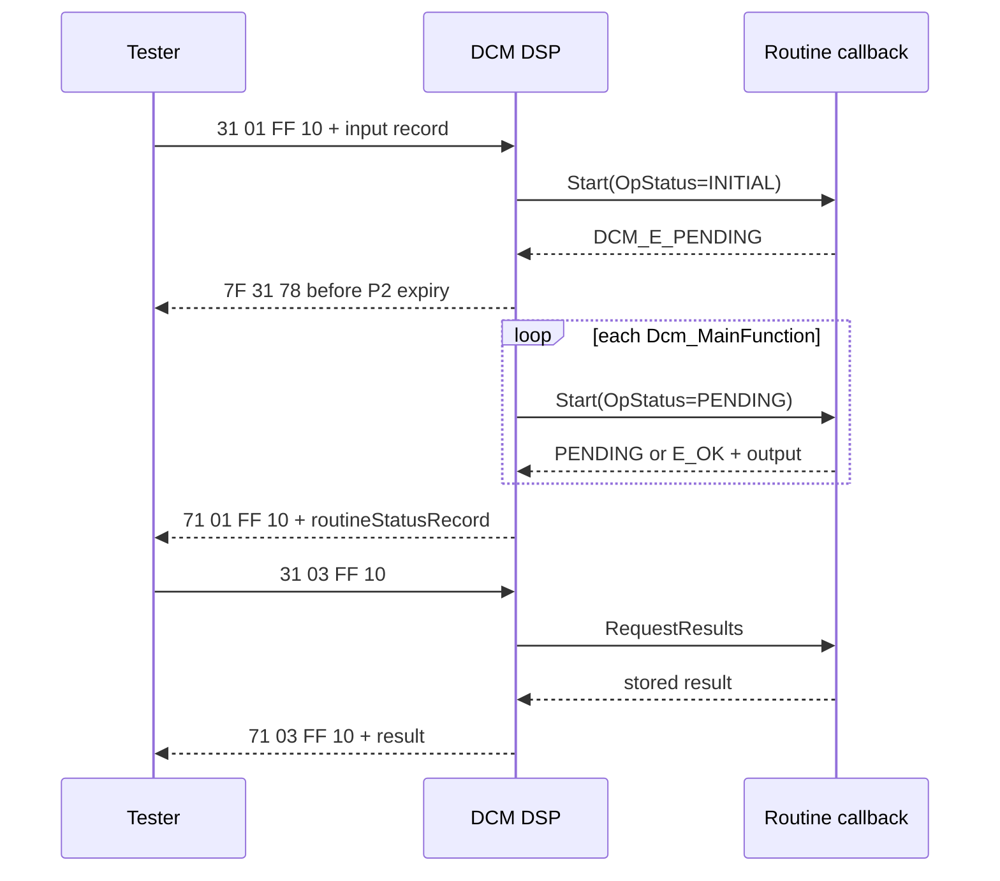

RequestResults không chạy lại routine. Application phải định nghĩa result lifetime, behavior sau reset/session change, concurrent start và cancellation (`DCM_CANCEL`/equivalent OpStatus khi applicable).

### NRC map

| Condition | NRC thường dùng |
|---|---:|
| RID/subfunction/input out of range | `31` |
| result requested before start | `24` |
| vehicle/precondition invalid | `22` |
| security locked | `33` |
| still processing | `78` |
| general execution failure | mapping theo callback/spec |

---

## 7. Physical và functional addressing

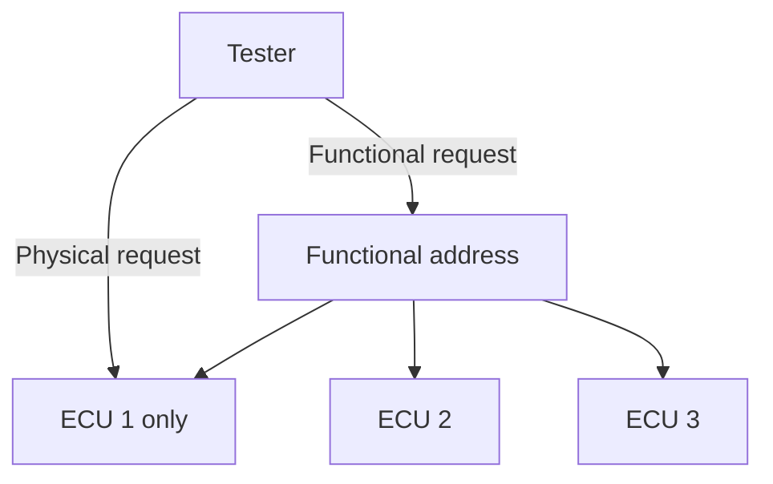

Functional broadcast có nguy cơ response storm. Protocol/OEM quy định service nào được phản hồi hoặc suppress khi functional. Write DID, security, reset thường được giới hạn physical, nhưng không coi đó là universal rule—phải xem service/addressing configuration.

Trong AUTOSAR, physical và functional thường là các `DcmDslProtocolRx`/RxPdu configuration khác nhau cùng connection/protocol context. CanIf/CanTp route dựa configured PDU ID; DCM biết request type từ Rx connection metadata, không suy từ SID.

---

## 8. Debug checklist theo symptom

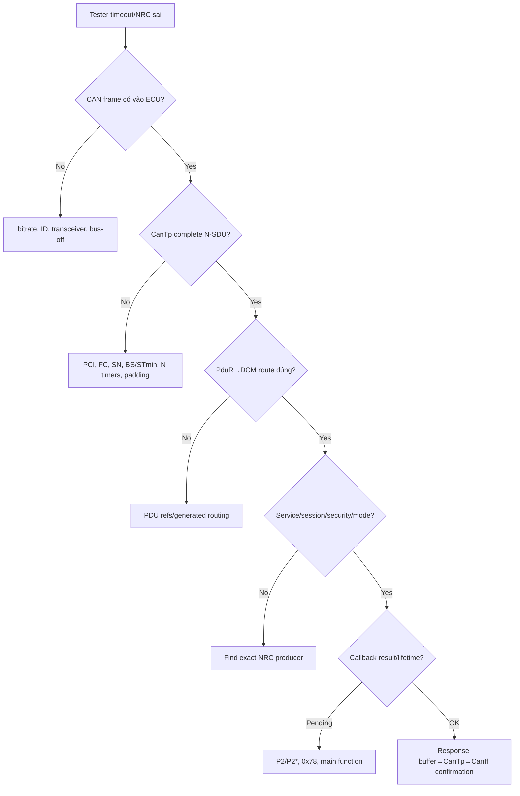

Thu thập cùng timestamp: CAN trace, DCM service/session/security state, callback entry/result, NvM/DEM job state và reset reason. Không sửa random timeout trước khi biết boundary đầu tiên mất data.

## 9. Bài tập bắt buộc

1. Vẽ lại VIN flow và ghi rõ byte nào thuộc PCI, UDS header và data.
2. Thêm VIN read vào lab rồi làm hỏng CF sequence để chứng minh reassembly fail.
3. Thêm vehicle-speed condition cho WriteDID; test NRC `22`.
4. Thay NvM sync demo thành async 3-cycle, phát `78` đúng P2 model.
5. Thêm S3 timer và chứng minh session/security reset khi hết hạn.
6. Tạo 3 DEM events, status mask filter và response `19 02` multi-frame.
7. Viết test chứng minh reset chỉ xảy ra sau simulated TxConfirmation.
8. Lập trace table requirement → ECUC container → generated artifact → callback → test.

Nguồn chuẩn để đọc sâu: [AUTOSAR DCM SWS R24-11](https://www.autosar.org/fileadmin/standards/R24-11/CP/AUTOSAR_CP_SWS_DiagnosticCommunicationManager.pdf), [AUTOSAR DEM SWS](https://www.autosar.org/fileadmin/standards/R20-11/CP/AUTOSAR_SWS_DiagnosticEventManager.pdf).
