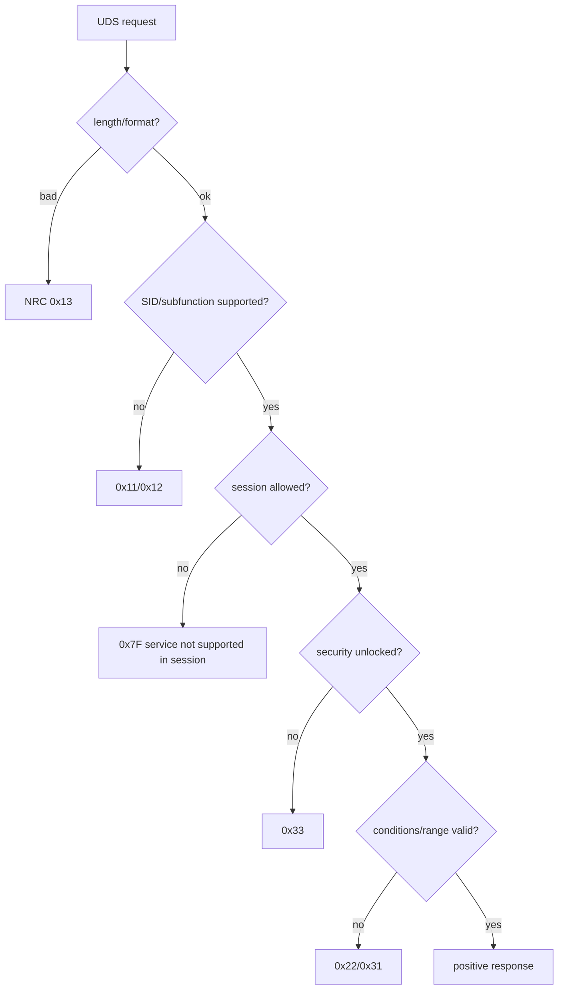

# Testing, diagnostic tools và debugging

## Access matrix

Test mỗi service/DID theo session × security × addressing × length × data range × vehicle condition. Positive test là thiểu số; negative response mới chứng minh access control.



## Debug by boundary

No response: CAN reception → CanIf PDU mapping → CanTp channel/addressing → PduR route → DCM connection/protocol → service access/callback → TX route. Capture frame/timestamp and inspect first missing indication.

FF received but no CF: check FC transmitted, addressing, BS/STmin, N_Bs/N_Br, receiver buffer. All CF received but no DCM request: check sequence number, total length, N_Cr, CopyRxData/RxIndication result.

NRC unexpected: identify layer generating it. CanTp timeout usually gives no UDS NRC because complete request never reached DCM; DCM/DSP produces NRC after valid N-SDU.

## Test levels

Unit callback/config validation; component DCM service dispatcher; ISO-TP transport tests; SIL tester scripts; HIL CAN timing/addressing; ECU reset/NvM persistence; security delay and brute-force protection.

## Tool workflow: CANoe và ODX/PDX

ODX mô tả góc nhìn tester: ECU variant, connection, service, parameter, DID/RID/DTC, session/security và conversion. PDX là exchange package. ODX không thay ECUC; ECUC cấu hình implementation phía ECU.

```text
Requirement/OEM spec
 ├─ ECU: DCM/DEM/CanTp/PduR ECUC + callbacks
 └─ Tester: ODX/PDX/test database → CANoe/tool → trace
```

Workflow: chọn ECU/connection → kiểm tra addressing → vào session/unlock nếu cần → gửi semantic hoặc raw request → quan sát transport/UDS/internal state → inject length/sequence/timing/value error → kiểm tra NvM/reset/persistence.

Automation phải assert payload, NRC, timing, state transition và persistence; không chỉ assert “có response”. XCP dùng measurement/calibration internal variable, không thay UDS service hoặc authorization.

## SIL và HIL evidence

SIL chứng minh algorithm/callback/state machine nhanh và repeatable. HIL thêm scheduler, controller/transceiver, real timing, power/reset và hardware I/O. Hai mức bổ sung cho nhau; evidence phải trace về requirement/risk.
