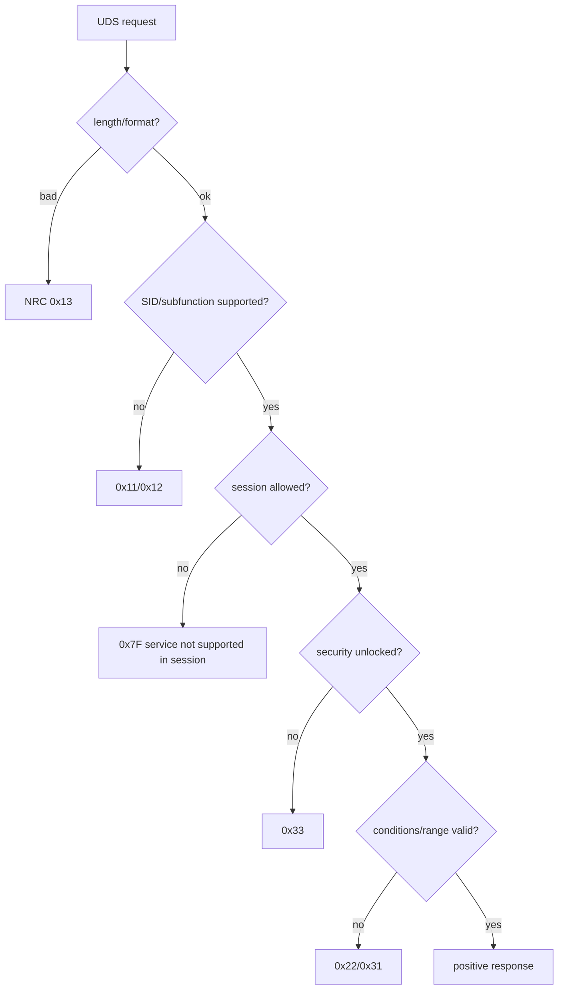

# Testing, diagnostic tools và debugging

## Access matrix

Test mỗi service/DID theo session × security × addressing × length × data range × vehicle condition. Positive test là thiểu số; negative response mới chứng minh access control.



## Debug by boundary

No response: CAN reception → CanIf PDU mapping → CanTp channel/addressing → PduR route → DCM connection/protocol → service access/callback → TX route. Capture frame/timestamp and inspect first missing indication.

FF received but no CF: check FC transmitted, addressing, BS/STmin, N_Bs/N_Br, receiver buffer. All CF received but no DCM request: check sequence number, total length, N_Cr, CopyRxData/RxIndication result.

NRC unexpected: identify layer generating it. CanTp timeout usually gives no UDS NRC because complete request never reached DCM; DCM/DSP produces NRC after valid N-SDU.

## Test levels

Unit callback/config validation; component DCM service dispatcher; ISO-TP transport tests; SIL tester scripts; HIL CAN timing/addressing; ECU reset/NvM persistence; security delay and brute-force protection.

## Tool workflow: CANoe và ODX/PDX

ODX mô tả góc nhìn tester: ECU variant, connection, service, parameter, DID/RID/DTC, session/security và conversion. PDX là exchange package. ODX không thay ECUC; ECUC cấu hình implementation phía ECU.

```text
Requirement/OEM spec
 ├─ ECU: DCM/DEM/CanTp/PduR ECUC + callbacks
 └─ Tester: ODX/PDX/test database → CANoe/tool → trace
```

Workflow: chọn ECU/connection → kiểm tra addressing → vào session/unlock nếu cần → gửi semantic hoặc raw request → quan sát transport/UDS/internal state → inject length/sequence/timing/value error → kiểm tra NvM/reset/persistence.

Automation phải assert payload, NRC, timing, state transition và persistence; không chỉ assert “có response”. XCP dùng measurement/calibration internal variable, không thay UDS service hoặc authorization.

## SIL và HIL evidence

SIL chứng minh algorithm/callback/state machine nhanh và repeatable. HIL thêm scheduler, controller/transceiver, real timing, power/reset và hardware I/O. Hai mức bổ sung cho nhau; evidence phải trace về requirement/risk.

## CANoe hands-on workflow

### 1. Tạo configuration

1. New Configuration → chọn CAN/CAN FD network và hardware channel.
2. Hardware Configuration: bitrate arbitration/data phase, sample point và termination phải khớp bench.
3. Add DBC để decode normal communication; DBC không tự chứa UDS service semantics.
4. Diagnostic/Diagnostics & XCP setup: import CDD/ODX/PDX nếu có; map ECU qualifier và diagnostic channel.
5. Cấu hình physical request/response ID, functional ID và addressing format theo ECU config.

Nếu không có ODX, dùng CAPL/raw ISO-TP hoặc Diagnostic Console với manually defined primitive tùy CANoe option/license.

### 2. Basic manual test

```text
10 03                  extended session
3E 00                  keep session
22 <DID>               read data
2E <DID> <data>        write data
19 02 FF               read DTC by status mask
31 01 <RID> <option>   start routine
```

Mở Trace Window và thêm columns Time, Channel, ID, Dir, DLC, Data, Name. Đồng thời mở Diagnostic Console để thấy semantic request/response. Với multi-frame, kiểm tra FF total length → FC status/BS/STmin → CF SN.

### 3. CAPL skeleton

```c
variables {
  diagRequest ECU.ReadDataByIdentifier req;
}

testcase TC_ReadDid_Positive() {
  diagSetParameter(req, "dataIdentifier", 0xF190);
  testWaitForTimeout(100);
  diagSendRequest(req);
  if (testWaitForDiagResponse(req, 1000) != 1) {
    testStepFail("response", "No diagnostic response");
    return;
  }
  if (diagGetLastResponseCode(req) == -1) {
    testStepPass("response", "Positive response received");
  } else {
    testStepFail("response", "Unexpected NRC");
  }
}
```

Tên primitive/parameter phụ thuộc diagnostic description. Raw API names cũng khác theo CANoe version; dùng Symbol Explorer/Help để lấy exact signature.

### 4. Negative and fault injection

| Test | Cách inject | Expected boundary |
|---|---|---|
| Wrong length | gửi raw UDS thiếu/thừa byte | DCM NRC `0x13` |
| Wrong session | gọi DID/RID trước `10 03` | `0x7E/0x7F/0x31` theo config |
| Missing FC | chặn FC tester | ECU CanTp N_Bs timeout |
| Wrong CF SN | sửa sequence nibble | receiver abort, thường không UDS NRC |
| STmin violation | phát CF quá nhanh | behavior theo CanTp strictness/config |
| S3 timeout | dừng `3E` | ECU về default session |
| NvM pending/fail | stub/calibration fault hook | `0x78`, final success/failure |
| Bus-off/power cycle | VT/HIL relay/controller control | recovery/persistence behavior |

### 5. Logging và evidence

- BLF/ASC trace với synchronized timestamp.
- Diagnostic report request/response semantic view.
- CAPL/Test Module verdict và requirement ID.
- ECU measurement: session, callback state, NvM result, Dem status.
- Configuration version, software version, DBC/ODX version và bench setup.

### 6. Debug order

```text
No CAN frame? → hardware/channel/bitrate/CanIf
CAN frame but no FC? → addressing/CanTp Rx path/buffer
Complete ISO-TP but no response? → PduR/DCM connection/service/access
NRC? → DSD/DSP condition and callback result
Positive but wrong data? → DID layout/endian/application owner
Works until reset? → NvM job, BswM/EcuM shutdown/startup
```
