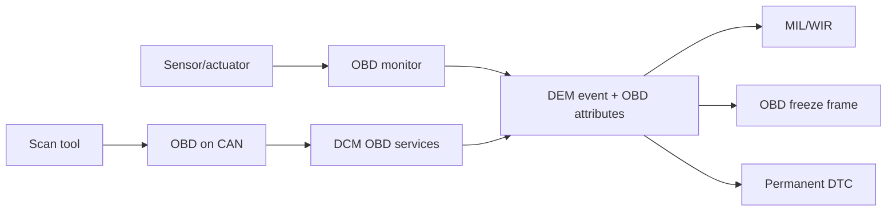

# OBD fundamentals — emissions diagnostics từ monitor tới tester

OBD là regulatory diagnostics tập trung vào emissions-related faults. UDS là general diagnostic protocol. Một ECU có thể support cả OBD và UDS trên cùng CAN network nhưng dùng protocol row, service table, addressing và data semantics khác nhau.

## 1. Kiến trúc



## 2. Modes thường gặp

| Mode | Chức năng |
|---:|---|
| `01` | Current powertrain data/PIDs và monitor status. |
| `02` | Freeze-frame data. |
| `03` | Stored emissions DTCs. |
| `04` | Clear emissions information theo điều kiện chuẩn. |
| `06` | On-board monitoring test results. |
| `07` | DTC detected trong current/last cycle tùy profile. |
| `09` | Vehicle information như calibration/software identifiers. |
| `0A` | Permanent DTC. |

Mode/PID không giống UDS SID/DID dù ý nghĩa có thể tương tự. Không gửi `22 <PID>` để thay Mode 01.

## 3. PID request example

```text
Request : 01 0C
Response: 41 0C A B
RPM = ((256 × A) + B) / 4
```

`0x41 = 0x01 + 0x40`. Scaling do PID definition quy định. Availability PID bitmap như `00/20/40...` cho biết các PID tiếp theo được support.

## 4. Monitor, trip và driving cycle

- Monitor chỉ chạy khi enable criteria thỏa: temperature, voltage, load, speed, time…
- Failed monitor cập nhật event; pending/confirmed progression phụ thuộc trip/cycle rules.
- Driving cycle và warm-up cycle phục vụ confirmation/healing/aging khác nhau.
- “Not complete” khác “passed”: monitor chưa chạy không được coi là pass.

## 5. Readiness

Readiness cho biết monitor đã hoàn tất kể từ clear/battery disconnect. Scan tool dùng readiness để đánh giá ECU có đủ evidence kiểm tra emissions hay không. Clear DTC có thể reset readiness; vì vậy clear để “xóa đèn” làm xe cần chạy lại enable conditions.

## 6. MIL, confirmed và permanent DTC

- MIL request đến từ indicator attributes/status processing, không phải application bật đèn trực tiếp tùy architecture.
- Confirmed DTC cần qualification/cycle criteria.
- Healing có thể tắt MIL sau good trips nhưng DTC history vẫn còn.
- Aging có thể xóa historical entry sau đủ aging cycle.
- Permanent DTC không bị xóa đơn giản bằng Mode 04; nó cần monitor chứng minh điều kiện pass theo regulatory behavior.

## 7. Freeze frame

Freeze frame là snapshot tại trigger, ví dụ RPM, load, coolant, vehicle speed, voltage. Tester đọc lại capture-time data; DEM không gọi sensor để lấy giá trị hiện tại. Snapshot record/selection và OBD freeze-frame capacity phải được cấu hình.

## 8. AUTOSAR mapping

| OBD concern | AUTOSAR area |
|---|---|
| OBD protocol/service | DCM protocol/service configuration |
| event qualification | monitor + DEM debounce/event |
| DTC format/OBD relevance | DemDTCClass/attributes |
| driving/warm-up cycle | DemOperationCycle |
| MIL | DemIndicator/IndicatorAttribute |
| freeze frame/PID data | Dem FreezeFrame/DataElement + DCM OBD data |
| persistence | DEM event memory + NvM |

Snapshot Toshiba cấu hình DEM là OBD primary ECU, có MIL indicator, DCY/WUC cycle, permanent memory và OBD freeze-frame entries.

## 9. Test checklist

1. PID support bitmap và scaling/boundary.
2. Monitor enable condition/not-complete/pass/fail.
3. Pending→confirmed qua đúng driving cycles.
4. MIL request và healing trips.
5. Freeze frame capture time/content.
6. Clear behavior/readiness reset.
7. Permanent DTC không bị xóa sai.
8. Warm-up/aging và power-cycle persistence.

## 10. Exercise

Vẽ flow sensor timeout → monitor fail → DEM event → pending/confirmed → MIL → Mode 03/02; sau đó thêm ba good trip và giải thích bit/status/memory nào thay đổi, cái nào chưa.

## 11. OBD event lifecycle example

Giả sử oxygen-sensor monitor chỉ được chạy khi coolant đủ nóng, closed-loop active và voltage hợp lệ:

```text
Key on
 → driving cycle START
 → enable criteria chưa đủ: monitor NOT COMPLETE
 → criteria đủ: monitor chạy
 → sample fail: monitor reports fault result
 → DEM sets pending/status and stores environmental data
 → fail ở required trip tiếp theo: confirmed + MIL request
 → good trips: healing may switch MIL off
 → warm-up cycles: aging progresses
```

Nếu monitor không chạy do enable condition chưa đủ, không được report PASSED chỉ để clear fault. Điều đó làm readiness và healing sai.

## 12. DTC status versus OBD meaning

| State | Tester interpretation |
|---|---|
| Test not complete | Chưa có evidence pass/fail cho required cycle. |
| Pending | Fault đã được detect nhưng chưa đạt full confirmation criteria. |
| Confirmed | Fault đạt configured/regulatory confirmation. |
| MIL requested | ECU yêu cầu warning indicator; có thể liên quan confirmed emissions DTC. |
| Healed | Recent good cycles đủ để tắt indicator, history có thể vẫn tồn tại. |
| Aged | Đủ aging cycles để loại historical status/memory theo policy. |

## 13. OBD freeze-frame design questions

Khi cấu hình snapshot phải trả lời:

1. Trigger ở first fail, pending, confirmed hay event-memory storage?
2. Nếu nhiều DTC cạnh tranh, DTC nào được ưu tiên OBD freeze frame?
3. Record chứa PID/DID nào, length/scaling/invalid value ra sao?
4. Capture synchronous có đảm bảo các signal cùng thời điểm không?
5. Memory full/displacement có giữ emissions-critical record không?
6. Snapshot có sống qua reset và clear theo đúng policy không?

## 14. Test vectors

```text
Mode 01 PID supported:
  request  = 01 0C
  response = 41 0C 1A F8
  rpm      = ((0x1A * 256) + 0xF8) / 4

Unsupported PID:
  expected behavior follows OBD profile; do not blindly map to UDS NRC.

Mode 03:
  inject monitor failure across required cycles
  verify stored code only after configured qualification

Mode 04:
  verify clear preconditions, response, readiness reset,
  event memory, MIL, permanent DTC and NvM separately.
```

## 15. Common interview traps

- OBD Mode 01 PID is not UDS DID.
- Pending is not identical to confirmed.
- Clear DTC does not guarantee permanent DTC disappears.
- MIL off does not prove event memory is empty.
- Readiness “not complete” is not monitor passed.
- Driving cycle, operation cycle and warm-up cycle are related but not interchangeable.
- CAN functional addressing does not mean every ECU must respond to every PID.
