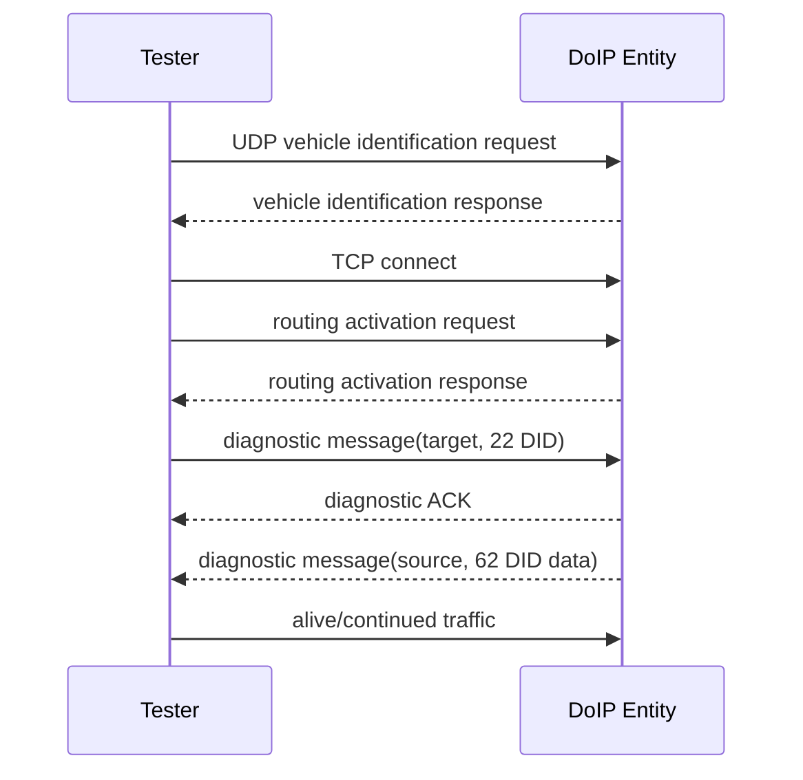

# DoIP — UDS trên Automotive Ethernet

DoIP vận chuyển diagnostic message qua IP/Ethernet. UDS service payload vẫn là `22`, `2E`, `31`… nhưng transport/session path khác ISO-TP trên CAN.

## 1. Stack

```text
UDS application
 → DCM
 → PduR
 → DoIP
 → SoAd
 → TCP/IP stack
 → Ethernet driver/transceiver
```

CAN path dùng CanTp chia SF/FF/CF/FC; DoIP dùng TCP byte stream cho diagnostic messages nên không dùng ISO-TP PCI.

## 2. UDP và TCP

| UDP | TCP |
|---|---|
| Vehicle identification/discovery | Diagnostic message transfer |
| Entity status/power mode requests | Routing activation connection |
| Không connection-oriented | Reliable ordered byte stream |

UDP giúp tester tìm entity; TCP được thiết lập rồi routing activation trước khi gửi UDS.

## 3. Generic header

DoIP message có generic header gồm protocol version, inverse version, payload type và payload length. Receiver kiểm tra version pair/length/type trước khi xử lý payload. Payload type phân biệt vehicle-identification, routing-activation, alive-check, diagnostic message, ACK/NACK…

```text
Generic header
 ├─ protocol version
 ├─ inverse protocol version
 ├─ payload type
 └─ payload length
Payload
```

## 4. Addresses

- IP/MAC định tuyến trên Ethernet network.
- DoIP logical source address nhận diện tester.
- DoIP logical target address nhận diện diagnostic entity/ECU.
- UDS payload không chứa IP address.

Không nhầm DoIP logical address với CAN ID hoặc DCM RxPduId.

## 5. Connection sequence



Diagnostic ACK chỉ xác nhận DoIP message được accept ở transport/entity level; nó không thay UDS positive response. Tester vẫn chờ `62...` hoặc `7F...`.

## 6. Routing activation

Routing activation authorize một TCP connection được route diagnostic traffic tới target. Nó có activation type, source address, response code và optional OEM data. Routing activation không tương đương UDS SecurityAccess; sau activation, SID/DID vẫn chịu session/security/condition của DCM.

## 7. Alive check và timeout

DoIP entity quản lý connection inactivity và có thể gửi alive-check. DCM vẫn quản lý P2/P2*/S3 ở diagnostic/session level. TCP retransmission timeout, DoIP inactivity và UDS timer là ba lớp khác nhau.

## 8. Large message behavior

TCP có thể chia một DoIP message qua nhiều Ethernet segments hoặc gom nhiều byte vào stream. Application không được giả định một `recv()` bằng một DoIP message; phải parse generic header và payload length. So với Classic CAN, bandwidth cao hơn và không cần ISO-TP FC/BS/STmin, phù hợp flashing/log data lớn.

## 9. Security considerations

- Restrict tester/network interface và routing activation policy.
- Validate header length/address/payload trước allocation/copy.
- Giới hạn connection/resource để chống exhaustion.
- UDS security/session vẫn bắt buộc cho protected operation.
- TLS hoặc secure onboard communication phụ thuộc architecture/OEM/profile; DoIP bản thân không làm mọi diagnostic traffic “an toàn”.

## 10. AUTOSAR configuration areas

| Concern | Module/config |
|---|---|
| IP/socket | TcpIp, SoAd |
| DoIP entity/logical address | DoIP |
| Route diagnostic PDU | PduR |
| Protocol/service/session | DCM |
| Network mode | EthSM/ComM/BswM |
| DTC/application data | DEM/RTE/application |

## 11. Debug checklist

1. Link/IP/VLAN/interface up.
2. Vehicle discovery response đúng identity/logical address.
3. TCP connect thành công.
4. Routing activation response code thành công.
5. DoIP header length/type/address đúng.
6. Diagnostic ACK/NACK khác UDS response.
7. PduR route tới đúng DCM connection/protocol.
8. P2/P2*/S3 và DoIP/TCP timeout được phân lớp.
9. Reconnect, multiple tester, alive check và resource limit.

## 12. Exercise

So sánh request đọc 100 byte data qua Classic CAN và DoIP: vẽ frame/message sequence, vị trí flow control, nơi timeout có thể xảy ra và module tạo failure indication.

## 13. Diagnostic message payload

Diagnostic message payload conceptually chứa:

```text
source logical address
target logical address
user data = UDS request/response bytes
```

Ví dụ tester logical address `0x0E00` gửi `22 F1 90` tới ECU `0x1001`. DoIP entity kiểm tra routing activation và target routing trước khi PduR/DCM nhìn thấy UDS payload. Response đảo source/target logical address và mang `62 F1 90 ...`.

## 14. ACK, NACK và UDS NRC

| Response | Layer | Ví dụ nguyên nhân |
|---|---|---|
| DoIP positive ACK | DoIP transport/entity | Diagnostic message accepted for routing. |
| DoIP negative ACK | DoIP transport/entity | Invalid source/target, message too large, route unavailable. |
| UDS positive | DCM/application | Service hoàn thành thành công. |
| UDS negative `7F` | DCM/DSP | SID/session/security/condition/data failure. |

Có DoIP ACK nhưng không có UDS response nghĩa route đã accept nhưng request có thể kẹt ở PduR/DCM/application hoặc timeout. Không có ACK thì debug DoIP addressing/routing trước.

## 15. TCP stream parser

```c
while (rxBytes >= DOIP_HEADER_SIZE) {
    header = ParseHeader(rxBuffer);
    if (!HeaderIsValid(header)) {
        CloseOrRejectConnection();
        break;
    }
    if (rxBytes < DOIP_HEADER_SIZE + header.payloadLength) {
        break;
    }
    DispatchDoIpPayload(header.payloadType,
                        &rxBuffer[DOIP_HEADER_SIZE],
                        header.payloadLength);
    Consume(DOIP_HEADER_SIZE + header.payloadLength);
}
```

TCP có thể trả nửa header, một message hoàn chỉnh, hoặc nhiều message trong một receive callback. Parser phải chống length overflow và giới hạn maximum payload trước allocation/copy.

## 16. Gateway scenario

Một central gateway có thể nhận DoIP từ Ethernet rồi route UDS tới ECU con trên CAN:

```text
Tester Ethernet
 → DoIP entity/gateway
 → PduR/gateway routing
 → CanTp
 → CAN target ECU
```

Khi đó có hai transport domains. Gateway phải quản lý buffer/backpressure, address translation và timeout. DoIP TCP nhanh không làm CAN downstream nhanh hơn; response lớn vẫn chịu FC/BS/STmin ở CAN segment.

## 17. CAN versus DoIP

| Topic | UDS on CAN | DoIP |
|---|---|---|
| Transport | ISO-TP | TCP + DoIP framing |
| Discovery | CAN ID/config known | UDP vehicle discovery |
| Addressing | CAN ID/addressing format | IP + logical source/target |
| Flow control | FC/BS/STmin | TCP flow/congestion control |
| Payload efficiency | thấp hơn, nhất là Classic CAN | phù hợp data/flashing lớn |
| Key failure | N-timer/SN/padding | socket/routing/header/address/inactivity |
| DCM UDS logic | tương tự | tương tự sau khi message tới DCM |

## 18. CANoe/Wireshark lab

1. Capture UDP vehicle identification and identify payload type.
2. Follow TCP stream and locate routing activation request/response.
3. Send `22 <DID>` and distinguish DoIP ACK from UDS `62`.
4. Change target logical address and observe DoIP NACK/no route.
5. Split a DoIP message over TCP segments and prove parser still works.
6. Stop application traffic and observe alive/inactivity behavior.
7. Compare timestamp of DoIP ACK, DCM callback and final UDS response.

## 19. Common interview traps

- DoIP is not “UDS replaced by Ethernet”; UDS payload remains.
- TCP eliminates ISO-TP segmentation but not application/session timing.
- Routing activation is not SecurityAccess.
- DoIP ACK is not UDS positive response.
- IP address is not DoIP logical address.
- One TCP receive callback is not guaranteed to equal one DoIP message.
