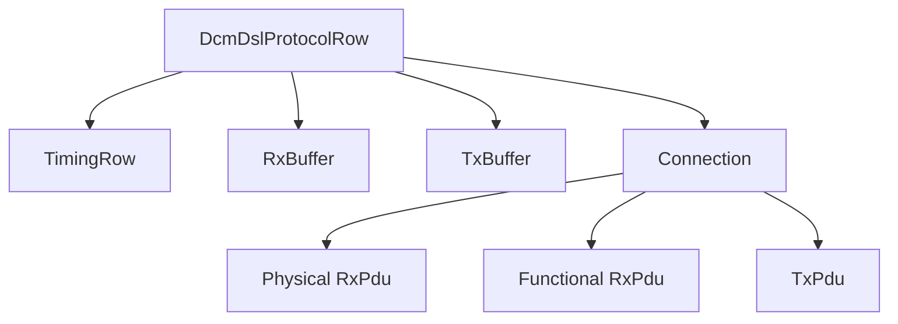

# DCM ECUC parameters — từ container tới runtime behavior

## DSL: protocol và connection

| Container/parameter concept | Tác dụng runtime |
|---|---|
| Protocol row / protocol ID | chọn UDS/OBD protocol behavior |
| Protocol priority | arbitration khi nhiều protocol request đồng thời |
| Preemption timeout | giới hạn chờ khi protocol ưu tiên cao preempt |
| Rx/Tx buffer references | nơi assemble request/response |
| Timing row reference | P2Server/P2StarServer behavior |
| Connection | nhóm physical/functional RX và TX response path |
| RxPdu reference | liên kết PduR→DCM reception ID |
| TxPdu reference | response route DCM→PduR |
| Addressing type | physical hay functional request |
| ComM channel reference | diagnostic-active communication request |

Sai RxPdu reference thường tạo symptom CAN nhận được nhưng DCM im lặng. Buffer nhỏ hơn request tạo overflow trước service dispatch. Sai protocol priority gây busy/preemption behavior khó hiểu.

## Session/security/timing rows

Session row định nghĩa session level/value, P2/P2* và transition callback/reference. Security row định nghĩa level, seed/key sizes, delay, attempts và callbacks. S3 thường là global/session inactivity timing trong DSL behavior.

P2/P2* tester và server là hai góc nhìn; configured server timing phải phù hợp network/tool requirement. DCM có thể gửi NRC `0x78` trước P2 expiry khi application còn pending.

## DSD service table

| Parameter | Câu hỏi review |
|---|---|
| SID | đúng service ID? duplicate? |
| Service handler/processor | internal DSP hay user service? |
| Has subfunction | suppress-positive-response bit có áp dụng? |
| Session references | service được phép session nào? |
| Security references | security gate ở service level? |
| Mode rule | vehicle conditions được kiểm tra ra sao? |

Service table được protocol row tham chiếu. Có entry DID nhưng service 0x22 không reachable trong table thì DID vẫn không đọc được.

## DSP DID/Data

`DcmDspDid` mô tả identifier và access; `DcmDspData` mô tả từng data element/callback.

Các concept phải hiểu: DID identifier, data size, fixed/variable length, endianness, data type, read/write/condition-check port, synchronous/asynchronous processing, session/security/mode rule và callback function/RTE port.

VIN `F190` thường là 17 ASCII byte. Positive response dài 20 byte (`62 F1 90 + 17`) nên trên Classic CAN cần ISO-TP multi-frame.

## DSP Routine

RID container cấu hình Start/Stop/RequestResults riêng, input/output/status record size và callback. Một routine chỉ support Start không được trả positive cho subfunction Stop. Routine async phải giữ state/result qua các lần callback và xử lý cancel/reset/session transition.

## DSP ECU Reset

Service `0x11` access/subfunction config kiểm soát hard/keyOffOn/soft reset loại nào support. DCM thường cần phối hợp BswM/EcuM/Mcu để thực hiện reset **sau khi positive response được truyền**, nếu reset sớm tester sẽ không nhận `51 01`.

## Add DID checklist

Requirement → DID/Data container → access rows → callback/RTE port → service table reachability → buffer size → NvM/DEM dependency → generated diff → unit/transport/session/security tests.
