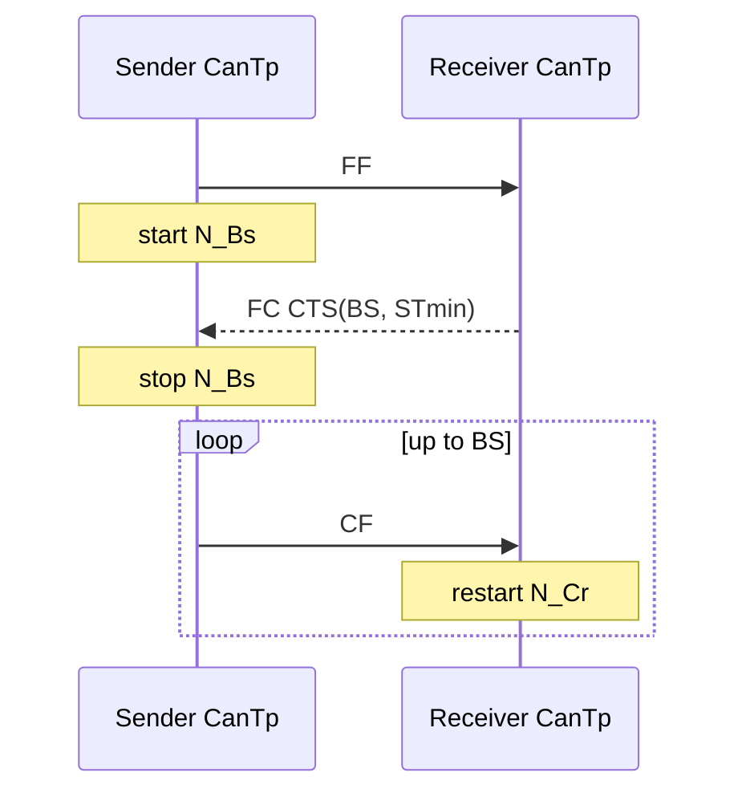

# CanTp ECUC parameters — channel, NSdu, addressing và timers

## RxNSdu

| Concept | Ý nghĩa |
|---|---|
| RxNSdu/Pdu references | map CanIf RX frame và upper PduR N-SDU |
| Addressing format | normal, extended, mixed variants theo network design |
| Target address type | physical/functional |
| `N_Ar` | receiver chờ confirmation FC transmit |
| `N_Br` | thời gian receiver chuẩn bị/trả FC/data buffer |
| `N_Cr` | receiver chờ CF kế tiếp |
| `BS` | số CF được phép trước FC tiếp |
| `STmin` | receiver yêu cầu sender giữ gap CF |
| `WFTmax` | số FC Wait tối đa |
| Padding activation/byte | DLC/padding validation/generation policy |

## TxNSdu

| Concept | Ý nghĩa |
|---|---|
| TxNSdu/Pdu refs | upper transmit request tới CanIf TX L-PDU |
| `N_As` | sender chờ frame TxConfirmation |
| `N_Bs` | sender chờ FC sau FF/block |
| `N_Cs` | sender chuẩn bị CF tiếp/upper CopyTxData |
| Padding | pad SF/FF/CF/FC theo config |
| Addressing/TA | header/address byte interpretation |

Timer config thường ở seconds trong ECUC float, trong khi main function chạy discrete period. Giá trị phải lớn hơn scheduling/CanIf latency với margin; quá nhỏ tạo intermittent timeout, quá lớn làm tester chờ lâu khi lỗi.

## MainFunctionPeriod

CanTp time base phụ thuộc cyclic call. ECUC period phải khớp SchM/OS scheduling thực. Config 5 ms nhưng task chạy 10 ms làm timer/spacing behavior sai.

## Addressing

Normal addressing dùng CAN ID để phân biệt endpoint. Extended/mixed thêm address byte trong payload, làm giảm payload mỗi frame. Physical/functional request thường dùng RxPdu khác; functional multi-frame có restriction theo protocol/OEM.

## Padding

TX pad đến configured DLC bằng padding byte; RX có thể kiểm tra length/padding rule. Padding không phải application data và không được chuyển vào DCM total N-SDU. CanTp biết total length từ PCI, nên bỏ phần ngoài length theo transport framing—not scan giá trị byte.

## Configuration review

CAN ID/CanIf PDU → CanTp Rx/Tx NSdu → PduR source/destination → DCM Rx/Tx connection phải tạo chuỗi ID nhất quán. Review cả direction và confirmation callback; một route RX đúng không bảo đảm TX response đúng.
