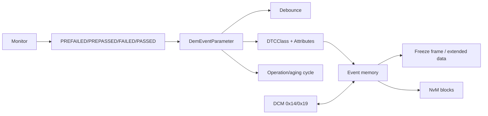

# DEM ECUC parameters — event, DTC, debounce và NvM

Snapshot Toshiba có 102 event parameter, 84 DTC class, 2 operation cycle, primary memory 5 entry và NvM mapping riêng cho status/aging/permanent/freeze-frame/event data.

## 1. Event không phải DTC



Một event là lỗi do một monitor báo. DTC là mã external mà tester đọc. Khi event combination bật, nhiều event có thể liên quan cùng DTC; vì vậy không giả định one-event-one-DTC.

## 2. DemGeneral snapshot

| Parameter | Giá trị | Runtime behavior |
|---|---:|---|
| `DemTaskTime` | 0.002 s | Chu kỳ xử lý DEM. |
| `DemUseNvm` | true | Persist diagnostic state qua NvM. |
| `DemDcmSupport` | true | Expose API cho DCM service 0x14/0x19. |
| `DemOBDSupport` | primary ECU | Bật OBD primary/MIL/permanent behavior. |
| `DemDtcStatusAvailabilityMask` | `0x7F` | Công bố các UDS status bit khả dụng cho tester. |
| `DemTypeOfDTCSupported` | ISO 15031-6 | DTC translation/format theo OBD profile. |
| `DemEventCombinationSupport` | Type 1 | Cho phép combine event theo DTC configuration. |
| Counter debounce support | false | Không dùng DEM counter-based debounce. |
| Time debounce support | false | Không dùng DEM time-based debounce. |
| `DemFreezeFrameCapture` | on event-memory storage | Capture khi event được store. |
| `DemExtendedDataCapture` | on event-memory storage | Cùng storage trigger. |
| displacement | priority + occurrence | Chọn entry bị thay khi memory full. |
| fallback | discard new event | Không displacement được thì bỏ entry mới. |
| `DemClearDTCBehavior` | volatile response | Clear RAM/response trước khi NvM sync hoàn tất theo behavior. |
| immediate Nv storage | true | Cho phép immediate storage đối với data/block phù hợp. |

`statusAvailabilityMask=0x7F` nghĩa ECU chỉ tuyên bố bảy bit thấp là supported trong response liên quan; không tự suy ra rằng mọi event luôn dùng đủ bảy bit.

## 3. DemEventParameter

| Parameter | Ý nghĩa |
|---|---|
| `DemEventId` | Numeric generated handle; application nên dùng symbolic ID. |
| `DemEventKind` | Event do SWC hay BSW report. |
| `DemEventAvailable`/variant | Event có tồn tại trong variant runtime/build. |
| `DemEventPriority` | Dùng trong displacement; số/chiều ưu tiên theo vendor rule. |
| `DemEventSignificance` | Fault hoặc occurrence significance. |
| `DemEventLatchTestFailed` | Có latch test-failed behavior không. |
| `DemEventFailureCycleCounterThreshold` | Số failure cycle cần cho configured transition. |
| `DemAgingAllowed`/threshold | Điều kiện và số aging cycle để aging. |
| `DemOperationCycleRef` | Cycle điều khiển this-cycle/status processing. |
| `DemEventFailureCycleRef` | Cycle dùng để đếm failure/confirmation progression. |
| `DemAgingCycleRef` | Cycle dùng cho aging. |
| `DemDTCClassRef` | Liên kết event với external DTC. |
| FreezeFrame/ExtendedData refs | Chọn data capture layout. |
| Indicator attributes | MIL/indicator behavior, failure/healing threshold. |

Không hard-code EventId numeric vì generator có thể renumber khi thêm/xóa event. Dùng `DemConf_DemEventParameter_<name>`.

## 4. Debounce trong snapshot

`DemDebounceCounterBasedSupport=false`, `DemDebounceTimeBasedSupport=false`; event dùng `DemDebounceMonitorInternal`. Monitor/application tự qualification rồi báo `FAILED/PASSED` hoặc quản lý PRE-state theo contract riêng. DEM không tự biến năm lần PREFAILED thành FAILED.

So sánh:

| Mode | Ai giữ counter/time? | Monitor báo gì? |
|---|---|---|
| Counter based | DEM | PREFAILED/PREPASSED; DEM tăng/giảm FDC. |
| Time based | DEM | PREFAILED/PREPASSED; DEM đo duration. |
| Monitor internal | Monitor | Monitor tự debounce và thường report FAILED/PASSED. |

FAILED/PASSED là qualified result. PREFAILED/PREPASSED chỉ là input cho debounce algorithm được cấu hình; nếu algorithm đó không active, không được kỳ vọng DEM tự debounce.

## 5. Operation cycle

| Cycle | Type | Auto start/end | Dùng cho |
|---|---|---|---|
| `DCY` | OBD driving cycle | false/false | Event status, failure/confirmation processing. |
| `WUC` | warm-up cycle | false/false | Aging. |

Vì không autostart/auto-end, EcuM/BswM/application phải gọi/trigger state transition đúng lúc. Nếu quên start cycle, status bit, confirmation, healing và aging không tiến triển như expectation.

## 6. Event memory và displacement

Primary memory:

- tối đa 5 event entries;
- storage trigger `ON_TEST_FAILED`;
- configured freeze-frame record numbering;
- tối đa 2 time-series snapshots;
- tối đa 5 OBD freeze-frame entries.

Memory capacity là số entry, không phải số event cấu hình. 102 event cùng cạnh tranh 5 primary slots theo DTC attributes, priority và displacement policy. `discard new event` có thể khiến DTC status thay đổi trong RAM nhưng không có full environmental data entry.

## 7. NvM mapping

Các block được tách theo trách nhiệm:

```text
ADMIN
STATUS
AGING
PERMANENT
FREEZEFRAME
PRIMARY[0..4]
TIMESERIES[0..1]
USERDEFINED[0x11, 0x12]
```

Tách block giúp kiểm soát dirty/write policy và endurance. Immediate storage không có nghĩa mọi report FAILED đều ghi flash ngay; còn phụ thuộc DTC/event attributes, block state và NvM scheduling.

## 8. Ví dụ event thực tế đã rút gọn

Một sensor event có:

- Event ID 35, kind SWC, priority 2, significance FAULT;
- DTC class dạng emissions code;
- operation/failure cycle DCY, aging cycle WUC;
- aging threshold 40;
- indicator healing threshold 3;
- PCU indicator và MIL attributes;
- monitor-internal debounce.

```text
monitor tự debounce lỗi
 → Dem_SetEventStatus(FAILED)
 → DEM cập nhật TestFailed/Pending/Confirmed theo cycle policy
 → allocate/displace primary entry
 → capture FF/extended data
 → schedule NvM persistence
 → DCM 0x19 đọc filter/status/record qua DEM API
```

Failure-cycle threshold `0` không có nghĩa event bỏ qua mọi qualification; nó chỉ nói về configured failure-cycle counter stage. Monitor debounce, operation cycle, DTC attributes và memory trigger vẫn có vai trò.

## 9. Clear DTC flow

```text
Tester 14 <group>
 → DCM validate request
 → DEM select group/client/origin
 → clear event status + memory data theo policy
 → positive response theo clear behavior
 → NvM synchronization hoàn tất sau đó nếu configured
```

Sau positive response, test phải kiểm tra RAM status, subsequent `0x19`, NvM job và power-cycle persistence; chỉ nhìn `54` là chưa đủ validate clear behavior.

## 10. Review checklist

1. Event ID unique và application dùng symbolic macro.
2. Event↔DTC mapping/combination đúng requirement.
3. Xác định rõ owner của debounce.
4. Operation/failure/aging cycle được start/end đúng.
5. Confirmation, healing và aging threshold không bị nhầm nhau.
6. Primary memory đủ capacity; displacement được test.
7. FF/extended data length/callback nhất quán với DCM 0x19.
8. NvM block mapping, immediate storage, shutdown và power-loss được test.
