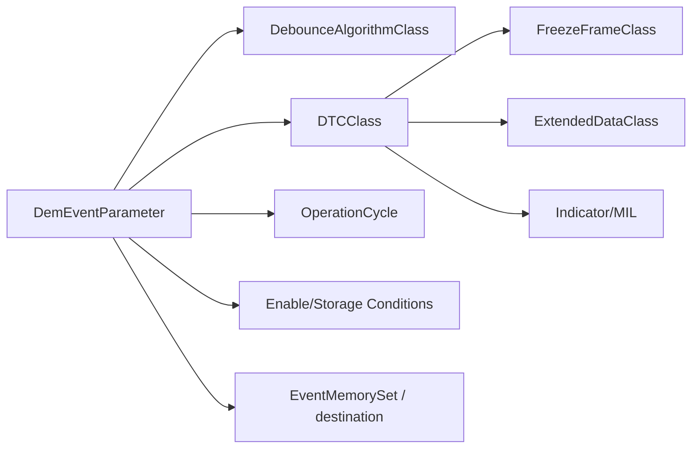

# DEM ECUC parameters — cấu hình một event đúng cách

## Core relationship

## Event parameter

Review event kind (BSW/SWC), event priority, DTC reference, debounce reference, operation cycle, confirmation/aging behavior, enable/storage conditions, available condition, memory destination, callback và indicator attribute.

Event ID trong code thường symbolic generated `DemConf_DemEventParameter_*`. Thay thứ tự/config có thể làm numeric ID đổi; application không hard-code số.

## Debounce counter parameters

Failed threshold, passed threshold, increment/decrement step, jump-up/jump-down, freeze/reset behavior. Ví dụ threshold fail +5, pass -5, increment 1 mỗi 10 ms: cần tối thiểu 50 ms liên tục nếu không có prepass xen giữa. Đây là qualification timing, không phải DTC confirmation cycle.

## Operation cycle và confirmation

Operation cycle start/end làm reset bit/counter theo rule. Confirmation threshold có thể cần lỗi ở nhiều cycle trước confirmed. Aging threshold cần nhiều cycle hoàn tất không lỗi. Healing indicator và aging DTC là hai cơ chế khác.

## DTC class

DTC number/format, severity/functional unit khi applicable, event mapping và OBD relevance. UDS DTC thường 3 byte; internal EventId không phải DTC number.

## Freeze frame

FreezeFrameClass chọn record number/trigger và DID list. Mỗi DID data class có size/callback. Snapshot callback phải deterministic và data length đúng. DCM service `19 04/06` đọc record đã capture; không gọi lại sensor để giả snapshot hiện tại.

## Extended data

ExtendedDataRecord có record number, update rule và data elements như occurrence counter, aging counter hoặc custom data. Update-on-test-failed khác update-on-confirmed/storage.

## Memory/displacement

Primary/secondary/permanent memory có capacity. Khi full, displacement dùng priority/active/pass/occurrence policy theo config. Immediate storage và NvM block mapping ảnh hưởng endurance/startup/shutdown timing.

## Example

Sensor timeout monitor gọi `PREFAILED` mỗi 10 ms khi age >100 ms, `PREPASSED` khi fresh. Counter debounce qualifies FAILED sau 5 sample. DTC pending trong cycle hiện tại, confirmed sau configured cycles; freeze frame capture ego speed/voltage/timeout age. Tester đọc qua `19 02` rồi `19 04/06`.

Nguồn: [AUTOSAR DEM SWS](https://www.autosar.org/fileadmin/standards/R20-11/CP/AUTOSAR_SWS_DiagnosticEventManager.pdf).
