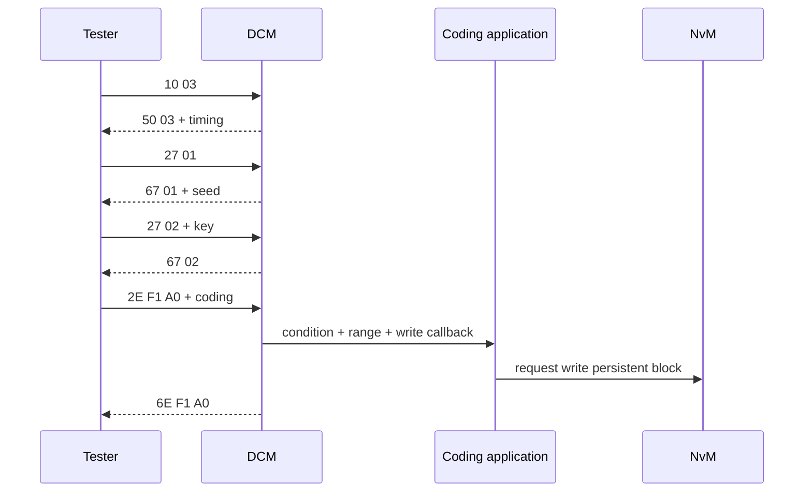

# Use cases UDS thực tế — request đi qua stack như thế nào?

## 1. Đọc VIN bằng DID F190

Request:

```text
22 F1 90
```

Positive response:

```text
62 F1 90 <17 ASCII VIN bytes>
```

Response 20 byte nên Classic CAN dùng FF/FC/CF. DCM DSP lookup DID F190, kiểm tra session/security/mode, gọi read callback, assemble response; CanTp segment. VIN thường read-only, data source có thể calibration/NvM/constant manufacturing data tùy architecture.

Negative tests: unknown DID `31`, callback condition failure `22`, wrong request length `13`, transport timeout không nhất thiết có NRC.

## 2. Write variant DID



Quan trọng: quyết định positive response trước hay sau NvM completion là requirement/API processing design. Nếu callback asynchronous, DCM có thể pending. Không trả positive nếu chỉ sửa RAM nhưng requirement yêu cầu guaranteed persistence trước response.

Variant data cần version/CRC/default/recovery và dependency validation. Sau write có thể update runtime NMSG/ports ngay, sau reset, hoặc qua ApplyCoding routine tùy requirement.

## 3. Hard Reset 11 01

Request `11 01`; response `51 01`. DCM kiểm tra session/security/condition, gọi reset preparation/BswM mode switch. ECU nên gửi response xong rồi reset theo configured sequence. Post-reset tester phải xử lý mất communication, boot time, default session và reconnect.

Negative cases: reset không support subfunction `12`, condition (programming/NvM busy/vehicle moving) `22`, session access `7F` tùy config.

## 4. TesterPresent 3E 00

Giữ extended/programming session bằng cách restart S3 timer. `3E 80` dùng suppress-positive-response bit nếu service/subfunction cho phép: ECU xử lý nhưng không gửi positive response. TesterPresent không unlock security và không giữ seed/key vô hạn nếu security/session policy reset.

## 5. Read DTC 19

`19 02 <statusMask>` đọc DTC by status mask; DCM dùng DEM filter/select/get-next workflow. Response có DTC + status byte. Snapshot/extended data dùng subfunction khác và record number. Tester phải hiểu availability mask/status semantics.

## 6. RoutineControl 31

Start `31 01 RID`, Stop `31 02`, Results `31 03`. Erase memory, dependency check hoặc apply coding có thể async. RequestResults không “chạy lại” routine; nó đọc state/result đã lưu. Sequence sai trả `24`, RID/subfunction/input invalid thường `31`, condition `22`, operation long có thể `78`.

## 7. Functional vs physical

Functional broadcast phù hợp discovery/basic request được phép; physical dùng ECU-specific response. Reset/write/security thường bị hạn chế functional để tránh nhiều ECU cùng phản ứng. Access là configuration/protocol/OEM requirement, không hard-code suy đoán.
