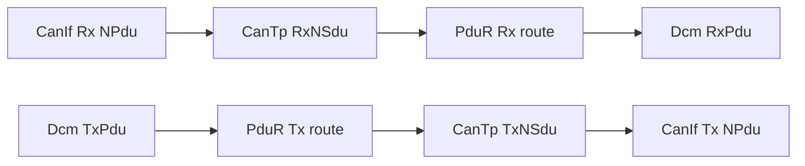

# PduR ECUC parameters — nối CanTp với DCM

PduR không hiểu UDS SID, DID, NRC hay ISO-TP PCI. Nó route PDU giữa module source và destination, đồng thời cung cấp adapter API cho IF/TP communication.

## 1. Diagnostic routing hai chiều



Snapshot có 6 diagnostic Rx route và 3 Tx route:

- Rx: functional + physical cho OBD, off-board UDS, on-board UDS.
- Tx: một physical response route cho mỗi client/protocol.

Functional request vẫn trả response qua physical Tx path; không cần functional Tx response route riêng.

## 2. RoutingPath

| Parameter | Snapshot | Ý nghĩa |
|---|---:|---|
| `PduRRoutingPathCommunicationType` | generated IF/TP type | Chọn adapter/callback family phù hợp. |
| `PduRMulticoreRoutingPath` | false | Route không qua cross-core transport. |
| `PduRLockRef` | shared lock ref | Đồng bộ table/buffer access theo generated design. |

Một routing path chứa đúng source PDU và một hoặc nhiều destination PDU. Diagnostic route trong snapshot chủ yếu one-to-one API forwarding.

## 3. Source PDU

| Parameter | Ý nghĩa |
|---|---|
| `PduRSourcePduHandleId` | Index nội bộ để generated API/table tra route. |
| `PduRSrcPduDirection` | `RECEIVE` khi source là CanTp Rx; `TRANSMIT` khi source là DCM Tx. |
| `PduRSrcPduRef` | Reference đến EcuC PDU mà source module sở hữu. |
| `PduRSrcPduPduRBswModulesRef` | Module source: CanTp hoặc DCM. |

Handle ID không phải CAN ID, DCM RxPduId hay CanTp NSduId dù đôi khi số vô tình giống nhau.

## 4. Destination PDU

| Parameter | Snapshot | Ý nghĩa |
|---|---:|---|
| `PduRDestPduHandleId` | generated destination index | Dùng cho callback/dispatch table. |
| `PduRDestPduDirection` | RECEIVE/TX tương ứng route | Hướng nhìn tại destination path. |
| `PduRDestPduRoutingType` | `API_FORWARDING` | Gọi API destination thay vì gateway buffer routing. |
| `PduRDestPduDataProcessing` | `IMMEDIATE` | Forward ngay trong processing path. |
| length strategy | `UNUSED` | Không áp IF-PDU length adaptation ở route này. |
| cross-partition destination | false | Không cần partition bridge. |
| `PduRDestPduRef` | EcuC destination PDU | Phải match DCM Rx hoặc CanTp Tx NSdu. |
| module ref | DCM/CanTp | Chọn generated adapter đúng. |

## 5. API behavior đối với TP route

RX multi-frame không phải PduR đợi đủ message trong một local array. PduR forward buffer negotiation/copy calls giữa CanTp và DCM:

```text
CanTp_StartOfReception → PduR → Dcm_StartOfReception
CanTp_CopyRxData       → PduR → Dcm_CopyRxData
CanTp_RxIndication     → PduR → Dcm_TpRxIndication
```

TX:

```text
Dcm_Transmit request   → PduR → CanTp_Transmit
CanTp_CopyTxData       → PduR → Dcm_CopyTxData
CanTp_TxConfirmation   → PduR → Dcm_TpTxConfirmation
```

Tên API cụ thể có thể được vendor prefix/generate khác, nhưng responsibility không đổi.

## 6. Mapping snapshot đã rút gọn

```text
RX OBD functional:     CanTp OBD_FUNC_RX  → PduR → DCM Rx ID 0
RX OBD physical:       CanTp OBD_PHYS_RX  → PduR → DCM Rx ID 1
RX offboard functional:CanTp UDS1_FUNC_RX → PduR → DCM Rx ID 2
RX offboard physical:  CanTp UDS1_PHYS_RX → PduR → DCM Rx ID 3
RX onboard physical:   CanTp UDS2_PHYS_RX → PduR → DCM Rx ID 4
RX onboard functional: CanTp UDS2_FUNC_RX → PduR → DCM Rx ID 5

TX OBD:      DCM Tx confirmation ID 0 → PduR → CanTp OBD_PHYS_TX
TX offboard: DCM Tx confirmation ID 1 → PduR → CanTp UDS1_PHYS_TX
TX onboard:  DCM Tx confirmation ID 2 → PduR → CanTp UDS2_PHYS_TX
```

## 7. Lỗi cấu hình và symptom

| Lỗi | Symptom |
|---|---|
| Source module ref sai | Wrong adapter hoặc generation validation error. |
| Rx destination ref sai | CAN/CanTp nhận đủ nhưng DCM không thấy request hoặc thấy ở connection sai. |
| Tx route thiếu | DCM tạo response nhưng không xuống CanTp. |
| TxConfirmation route sai | Response lên bus nhưng DCM không hoàn tất request/state. |
| IF/TP type sai | Copy/StartOfReception API mismatch. |
| Handle duplicate/out-of-range | Table lookup sai, DET hoặc undefined routing. |
| Immediate path gọi callback quá nặng | Tăng latency/call-stack và ảnh hưởng real-time. |

## 8. Review method

Không review PduR độc lập. Chọn một PDU và trace symbolic references end-to-end:

```text
CAN ID/CanIf RxPdu
 → CanTp RxNPdu/RxNSdu
 → PduR source/destination refs
 → DCM RxPduId/connection/protocol/service table
 → DCM TxPdu
 → PduR reverse route
 → CanTp TxNSdu/TxNPdu
 → CanIf TxPdu/CAN ID
```

Sau đó test SF và multi-frame vì multi-frame mới exercise đầy đủ StartOfReception/CopyRxData/CopyTxData/FC/confirmation path.
